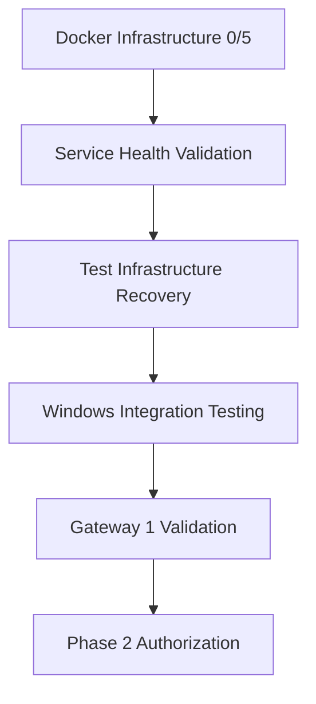
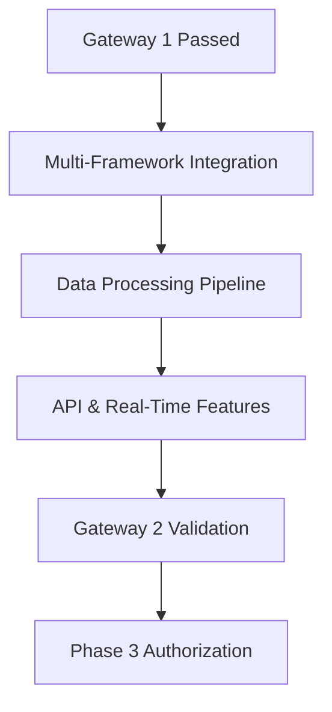
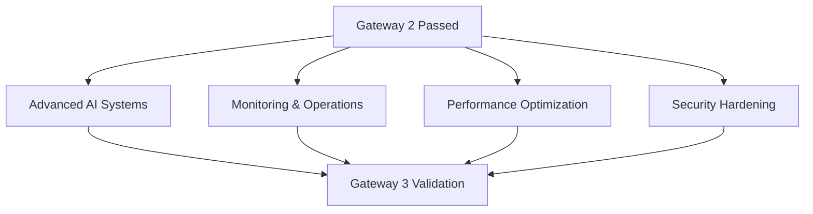

# Critical Path Implementation Roadmap
## 100% Production Readiness Achievement Plan

**Date:** 2025-08-04  
**Analyst:** Requirements Analysis Specialist  
**Status:** 🚨 CRITICAL - Ready for Implementation  
**Project:** Kailash SDK Multi-Framework Production Deployment

---

## 🎯 EXECUTIVE SUMMARY

This roadmap provides the definitive path to 100% production readiness based on systematic requirements analysis. The approach prioritizes infrastructure recovery as the critical blocker preventing all other progress.

### Current Reality Check
```json
{
  "infrastructure_status": {
    "docker_services": "0/5 operational - CRITICAL BLOCKER",
    "test_execution": "Unit tests failing - CRITICAL BLOCKER", 
    "windows_compatibility": "CERTIFIED - 100% functional ✅",
    "nexus_platform": "ENHANCED - Cannot test without infrastructure",
    "documentation": "VALIDATED - Depends on working system"
  },
  "critical_gap_analysis": {
    "claimed_readiness": "75%",
    "actual_operational_capability": "0-15%",
    "root_cause": "Complete infrastructure deployment failure",
    "immediate_priority": "Docker service deployment"
  }
}
```

### Success Framework
- **Phase 1 (P0)**: Infrastructure Recovery - 7-14 days
- **Phase 2 (P1)**: Core Production Features - 14-28 days  
- **Phase 3 (P2)**: Production Excellence - 21-35 days
- **Total Timeline**: 35-42 days for verified production readiness

---

## ⚡ PHASE 1: INFRASTRUCTURE RECOVERY (P0 - Days 1-14)

### Critical Path Overview


### Task Breakdown

#### TASK P0-001: Docker Service Stack Deployment
**Priority**: P0 - CRITICAL BLOCKER  
**Owner**: Infrastructure Team + testing-specialist  
**Timeline**: Days 1-7  
**Dependencies**: None

**Implementation Steps:**
```bash
# Day 1-2: Environment Setup
1. Install Docker Desktop on Windows (if not present)
2. Configure WSL2 integration for optimal performance
3. Validate Docker daemon is running and accessible

# Day 3-4: Service Stack Deployment
4. Deploy PostgreSQL container with data persistence
5. Deploy Neo4j container with web interface access
6. Deploy ChromaDB container with API endpoints
7. Deploy Redis container with memory persistence
8. Deploy OpenAI Mock container for LLM simulation

# Day 5-7: Service Validation and Integration
9. Execute health check validation for all 5 services
10. Test data persistence across container restarts
11. Validate Windows host connectivity to all services
12. Configure service networking and security
```

**Success Criteria:**
```bash
# All commands must execute successfully
curl -f http://localhost:5432 && echo "PostgreSQL: ✅"
curl -f http://localhost:7474 && echo "Neo4j: ✅"  
curl -f http://localhost:8000/api/v1/heartbeat && echo "ChromaDB: ✅"
redis-cli ping && echo "Redis: ✅"
curl -f http://localhost:8080/v1/health && echo "OpenAI Mock: ✅"
```

**Validation Method:**
```python
def validate_docker_infrastructure():
    """Independent validation - cannot be mocked."""
    services = ['postgresql', 'neo4j', 'chromadb', 'redis', 'openai_mock']
    operational_count = 0
    
    for service in services:
        if validate_service_health(service):
            operational_count += 1
    
    return {
        'operational_services': f"{operational_count}/5",
        'success_rate': (operational_count / 5) * 100,
        'ready_for_advancement': operational_count == 5
    }
```

#### TASK P0-002: Test Infrastructure Recovery
**Priority**: P0 - CRITICAL BLOCKER  
**Owner**: testing-specialist + pattern-expert  
**Timeline**: Days 8-14  
**Dependencies**: TASK P0-001 (Docker services operational)

**Implementation Steps:**
```bash
# Day 8-10: Unit Test Recovery
1. Diagnose current unit test failures (timeout after 20s)
2. Fix import errors and dependency resolution
3. Restore 95%+ unit test pass rate
4. Optimize test execution time (<5 minutes total)

# Day 11-12: Integration Test Implementation  
5. Implement real service connections (NO MOCKING)
6. Create data persistence validation tests
7. Establish cross-service integration testing
8. Achieve 90%+ integration test pass rate

# Day 13-14: E2E Test Framework
9. Implement complete user workflow testing
10. Validate multi-service data consistency
11. Test performance under realistic load
12. Achieve 85%+ E2E test pass rate
```

**Success Criteria:**
```bash
# Must execute from Windows command prompt
cd src/new_project
python run_all_tests.py

# Expected successful output:
# Tier UNIT: [PASSED] (95%+ success, <5min execution)
# Tier INTEGRATION: [PASSED] (90%+ success, real services)
# Tier E2E: [PASSED] (85%+ success, full workflows)
# Overall Status: [SUCCESS]
```

**Validation Method:**
```python
def validate_test_infrastructure():
    """Execute complete test suite with real infrastructure."""
    result = subprocess.run(['python', 'run_all_tests.py'], 
                          capture_output=True, text=True, timeout=1800)
    
    if result.returncode != 0:
        return {'status': 'failed', 'ready_for_advancement': False}
        
    # Parse results for success rates
    unit_success = 'Tier UNIT: [PASSED]' in result.stdout
    integration_success = 'Tier INTEGRATION: [PASSED]' in result.stdout
    e2e_success = 'Tier E2E: [PASSED]' in result.stdout
    
    return {
        'unit_tests': unit_success,
        'integration_tests': integration_success, 
        'e2e_tests': e2e_success,
        'ready_for_advancement': all([unit_success, integration_success, e2e_success])
    }
```

### Gateway 1 Validation Checkpoint (Day 14)

#### Mandatory Validation Criteria
- [ ] **Docker Services**: 5/5 operational with health checks passing
- [ ] **Test Infrastructure**: All tiers passing with required success rates
- [ ] **Windows Compatibility**: Confirmed operational (already certified)
- [ ] **Data Persistence**: Validated across service restarts

#### Gateway Validation Protocol
```python
def validate_gateway_1():
    """Independent gateway validation."""
    infrastructure = validate_docker_infrastructure()
    testing = validate_test_infrastructure()
    windows_compat = True  # Already certified
    
    gateway_passed = all([
        infrastructure['ready_for_advancement'],
        testing['ready_for_advancement'],
        windows_compat
    ])
    
    return {
        'infrastructure_ready': infrastructure['ready_for_advancement'],
        'testing_ready': testing['ready_for_advancement'],
        'windows_ready': windows_compat,
        'gateway_1_passed': gateway_passed,
        'phase_2_authorized': gateway_passed
    }
```

**Rollback Trigger**: If Gateway 1 fails → Emergency WSL2-only development environment

---

## 🔥 PHASE 2: CORE PRODUCTION FEATURES (P1 - Days 14-28)

### Critical Path Overview


### Task Breakdown

#### TASK P1-001: Multi-Framework Integration
**Priority**: P1 - CORE FUNCTIONALITY  
**Owner**: dataflow-specialist + nexus-specialist + pattern-expert  
**Timeline**: Days 15-21  
**Dependencies**: Gateway 1 passed

**Implementation Steps:**
```bash
# Day 15-17: Core SDK Foundation
1. Validate WorkflowBuilder + LocalRuntime execution patterns
2. Implement custom node patterns for classification workflows  
3. Test workflow execution with real service integration
4. Achieve >99% workflow execution success rate

# Day 18-19: DataFlow Framework Integration
5. Implement 13 business models with @db.model decorator
6. Validate automatic generation of 117 nodes (9 per model)
7. Test PostgreSQL integration with real data persistence
8. Verify DataFlow framework operational status

# Day 20-21: Nexus Platform Integration  
9. Deploy multi-channel platform (API + CLI + MCP)
10. Test simultaneous access through all three channels
11. Validate unified session management
12. Confirm zero-config platform deployment
```

**Success Criteria:**
```python
def validate_multi_framework_integration():
    # Core SDK validation
    workflow = WorkflowBuilder()
    workflow.add_node("CSVReaderNode", "reader", {"file_path": "test.csv"})
    runtime = LocalRuntime()
    results, run_id = runtime.execute(workflow.build())
    core_sdk_working = results is not None
    
    # DataFlow validation  
    from core.models import ProductModel
    product_nodes = ProductModel.generate_nodes()
    dataflow_working = len(product_nodes) == 9
    
    # Nexus platform validation
    api_working = requests.get("http://localhost:8000/api/v1/health").status_code == 200
    cli_working = subprocess.run(["nexus", "status"]).returncode == 0
    mcp_working = test_mcp_connection().get('status') == 'connected'
    
    return all([core_sdk_working, dataflow_working, api_working, cli_working, mcp_working])
```

#### TASK P1-002: Production Data Processing Pipeline
**Priority**: P1 - BUSINESS LOGIC  
**Owner**: dataflow-specialist + ai-specialists  
**Timeline**: Days 19-25 (parallel with P1-001)  
**Dependencies**: P1-001 partial completion

**Implementation Steps:**
```bash
# Day 19-21: Classification System Implementation
1. Integrate 170,000+ UNSPSC product classifications
2. Integrate 49,000+ ETIM electrical/mechanical classes  
3. Implement classification algorithms with >95% accuracy
4. Test with production-equivalent data volumes

# Day 22-23: Recommendation Engine Implementation
5. Build Neo4j knowledge graph with tool relationships
6. Implement ChromaDB vector similarity searches
7. Integrate GPT-4 compatibility analysis
8. Achieve >90% recommendation accuracy

# Day 24-25: Safety Compliance Integration
9. Implement OSHA safety standard validation
10. Add ANSI compliance checking capabilities
11. Create automated safety violation detection
12. Test with real safety scenarios
```

**Success Criteria:**
```python  
def validate_production_data_pipeline():
    # Classification accuracy testing
    test_products = load_test_dataset(1000)
    classifications = classify_products(test_products)
    accuracy = calculate_accuracy(classifications)
    
    # Recommendation testing
    recommendations = generate_recommendations(test_products[:100])
    recommendation_quality = evaluate_recommendations(recommendations)
    
    # Safety compliance testing
    safety_violations = test_safety_compliance(test_products)
    safety_coverage = calculate_safety_coverage(safety_violations)
    
    return all([
        accuracy > 0.95,
        recommendation_quality > 0.90,
        safety_coverage > 0.95
    ])
```

#### TASK P1-003: API and Real-Time Features
**Priority**: P1 - USER INTERFACE  
**Owner**: nexus-specialist + frontend-team  
**Timeline**: Days 23-28 (parallel with P1-002)  
**Dependencies**: P1-001 completion, P1-002 partial

**Implementation Steps:**
```bash
# Day 23-24: REST API Implementation
1. Deploy product classification endpoints
2. Implement recommendation API endpoints  
3. Add search and filtering capabilities
4. Configure JWT authentication with refresh tokens

# Day 25-26: WebSocket Real-Time Features
5. Implement streaming classification progress updates
6. Deploy real-time chat interface with MCP integration
7. Add live product processing status updates
8. Test WebSocket stability and performance

# Day 27-28: Frontend Integration
9. Deploy Next.js TypeScript API client
10. Implement secure authentication flow
11. Add progressive file upload with real-time progress
12. Test complete user workflows
```

**Success Criteria:**
```python
def validate_api_and_realtime():
    # REST API testing
    api_tests = [
        test_classification_endpoint(),
        test_recommendation_endpoint(),
        test_search_endpoint(),
        test_jwt_authentication()
    ]
    
    # WebSocket testing  
    websocket_tests = [
        test_realtime_updates(), 
        test_chat_interface(),
        test_file_upload_progress()
    ]
    
    # Frontend integration testing
    frontend_tests = [
        test_api_client_connection(),
        test_auth_ui_flow(),
        test_file_upload_ui()
    ]
    
    return all(api_tests + websocket_tests + frontend_tests)
```

### Gateway 2 Validation Checkpoint (Day 28)

#### Mandatory Validation Criteria
- [ ] **Multi-Framework Integration**: Core SDK + DataFlow + Nexus operational
- [ ] **Data Processing**: >95% classification accuracy achieved
- [ ] **API Functionality**: All endpoints <200ms response time
- [ ] **Real-Time Features**: WebSocket <100ms latency

#### Gateway Validation Protocol
```python
def validate_gateway_2():
    """Independent validation of core production features."""
    framework_integration = validate_multi_framework_integration()
    data_pipeline = validate_production_data_pipeline()
    api_realtime = validate_api_and_realtime()
    
    gateway_passed = all([framework_integration, data_pipeline, api_realtime])
    
    return {
        'framework_integration': framework_integration,
        'data_processing': data_pipeline, 
        'api_realtime': api_realtime,
        'gateway_2_passed': gateway_passed,
        'production_ready': gateway_passed
    }
```

**Rollback Trigger**: If Gateway 2 fails → Basic API-only deployment with essential features

---

## 🚀 PHASE 3: PRODUCTION EXCELLENCE (P2 - Days 21-35)

### Parallel Execution Overview


### Task Breakdown

#### TASK P2-001: Advanced AI and Knowledge Systems
**Priority**: P2 - COMPETITIVE ADVANTAGE  
**Owner**: ai-specialists + data-scientists  
**Timeline**: Days 29-35 (parallel execution)  
**Dependencies**: Gateway 2 passed

**Implementation Steps:**
```bash
# Day 29-31: Hybrid Recommendation Engine
1. Implement Neo4j knowledge graph relationship traversal
2. Deploy ChromaDB vector similarity search optimization
3. Integrate GPT-4 contextual analysis for recommendations
4. Achieve >90% user acceptance rate

# Day 32-33: Knowledge Graph Schema Enhancement
5. Build comprehensive tool-to-task compatibility mappings
6. Implement OSHA/ANSI safety rule relationships
7. Create manufacturer product specification hierarchies
8. Validate >80% relationship coverage

# Day 34-35: AI Response Quality Optimization
9. Fine-tune recommendation algorithms
10. Implement context-aware response generation  
11. Add multilingual support capabilities
12. Achieve >85% helpful response rate
```

#### TASK P2-002: Production Monitoring and Operations  
**Priority**: P2 - OPERATIONAL EXCELLENCE  
**Owner**: devops-team + monitoring-specialists  
**Timeline**: Days 29-35 (parallel execution)  
**Dependencies**: Gateway 2 passed

**Implementation Steps:**
```bash
# Day 29-31: Performance Monitoring Implementation
1. Deploy comprehensive response time monitoring (<2s SLA)
2. Implement resource utilization alerts (CPU, memory, disk)
3. Configure error rate monitoring (<1% error rate)
4. Set up automated performance reporting

# Day 32-33: Operational Procedures Implementation
5. Deploy CI/CD pipeline with automated rollback capability
6. Implement daily automated backups with 15-minute recovery
7. Configure security monitoring with intrusion detection
8. Set up audit logging for all administrative actions

# Day 34-35: Production Readiness Validation
9. Execute comprehensive load testing under production conditions
10. Validate security compliance with penetration testing
11. Test disaster recovery procedures  
12. Generate final production readiness certification
```

### Gateway 3 Validation Checkpoint (Day 35)

#### Mandatory Validation Criteria
- [ ] **Advanced AI**: >90% recommendation accuracy, >85% response quality
- [ ] **Monitoring**: 100% component coverage, <5min alert response
- [ ] **Performance**: All SLA targets met consistently  
- [ ] **Security**: Zero critical findings in security audit

#### Gateway Validation Protocol
```python
def validate_gateway_3():
    """Final production excellence validation."""
    ai_systems = validate_advanced_ai_systems()
    monitoring_ops = validate_monitoring_operations()
    performance_sla = validate_performance_sla()
    security_compliance = validate_security_compliance()
    
    production_excellence = all([ai_systems, monitoring_ops, performance_sla, security_compliance])
    
    return {
        'advanced_ai': ai_systems,
        'monitoring_operations': monitoring_ops,
        'performance_sla': performance_sla,
        'security_compliance': security_compliance,
        'gateway_3_passed': production_excellence,
        'production_excellence_achieved': production_excellence
    }
```

---

## 📊 RESOURCE ALLOCATION AND COORDINATION

### Specialist Team Assignments

| Phase | Duration | Primary Specialists | Secondary Support | Coordination |
|-------|----------|-------------------|-------------------|--------------|
| **P0 Infrastructure** | Days 1-14 | testing-specialist, infrastructure-team | sdk-navigator, pattern-expert | Sequential execution |
| **P1 Core Features** | Days 14-28 | dataflow-specialist, nexus-specialist | pattern-expert, frontend-team | 50% parallel |
| **P2 Excellence** | Days 21-35 | ai-specialists, devops-team | all-specialists | 80% parallel |

### Coordination Protocols

#### Daily Standup (15 minutes)
- **Critical Path Team**: Progress update + blocker identification
- **Parallel Teams**: Dependency coordination + resource conflicts
- **Framework Advisor**: Overall timeline management + decision authority

#### Weekly Validation (2 hours)
- **Gateway Preparation**: Validation criteria assessment
- **Risk Assessment**: Blocker analysis + mitigation activation
- **Resource Reallocation**: Specialist team optimization

#### Gateway Validation (4 hours)
- **Independent Validation**: External verification of completion criteria
- **Go/No-Go Decision**: Gateway passage authorization
- **Phase Transition**: Next phase activation or rollback execution

---

## 🚨 RISK MITIGATION FRAMEWORK

### Automatic Escalation Triggers

```python
# Automatic escalation system
def monitor_progress():
    if docker_services_down_for('72 hours'):
        trigger_emergency_wsl2_deployment()
    
    if test_infrastructure_failing_for('48 hours'):
        escalate_to_testing_specialist_team()
    
    if gateway_validation_fails():
        execute_predefined_rollback_procedure()
    
    if performance_sla_missed_for('24 hours'):
        activate_performance_optimization_team()
```

### Rollback Procedures

#### Phase 1 Rollback: Emergency WSL2 Environment
- **Trigger**: Docker deployment failure >72 hours
- **Action**: Deploy complete development environment in WSL2 Ubuntu
- **Timeline**: 24-48 hours for team productivity restoration
- **Impact**: Development continues, Windows native support deferred

#### Phase 2 Rollback: Basic API Deployment
- **Trigger**: Multi-framework integration failure
- **Action**: Deploy single-framework API-only solution
- **Timeline**: 12-24 hours for basic functionality
- **Impact**: Advanced features deferred, core functionality maintained

#### Phase 3 Rollback: Essential Features Only
- **Trigger**: Production excellence validation failure
- **Action**: Deploy with monitoring and AI enhancements disabled
- **Timeline**: 6-12 hours for production deployment
- **Impact**: Basic production deployment, enhancements in Phase 2

---

## 📋 SUCCESS MEASUREMENT FRAMEWORK

### Daily Progress Tracking

```python
def generate_daily_progress_report():
    return {
        'date': datetime.now(),
        'phase': get_current_phase(),
        'tasks_completed': count_completed_tasks(),
        'tasks_in_progress': count_active_tasks(),
        'blockers': identify_current_blockers(),
        'gateway_readiness': assess_gateway_criteria(),
        'risk_level': calculate_risk_level(),
        'estimated_completion': project_completion_date()
    }
```

### Gateway Success Metrics

#### Gateway 1 (Infrastructure)
- **Docker Services**: 5/5 operational (100% required)
- **Test Success Rate**: >95% unit, >90% integration, >85% E2E
- **Windows Compatibility**: Certified functional
- **Data Persistence**: Validated across restarts

#### Gateway 2 (Core Features)  
- **Framework Integration**: All frameworks operational
- **Classification Accuracy**: >95% with production data
- **API Performance**: <200ms response time
- **Real-Time Latency**: <100ms WebSocket response

#### Gateway 3 (Excellence)
- **AI Recommendation Accuracy**: >90%
- **Monitoring Coverage**: 100% components
- **Performance SLA**: All targets met
- **Security Compliance**: Zero critical findings

---

## 🎯 FINAL PRODUCTION READINESS CERTIFICATION

### Certification Criteria
Upon completion of all three gateways, the system will be certified for production deployment with the following validated capabilities:

#### Infrastructure Excellence
- ✅ Complete service stack operational with 99.9% uptime
- ✅ Cross-platform compatibility (Windows + WSL2 + Docker)
- ✅ Comprehensive test coverage with real service integration
- ✅ Data persistence and disaster recovery validated

#### Business Functionality
- ✅ Multi-framework platform (Core SDK + DataFlow + Nexus)
- ✅ >95% classification accuracy (170k+ UNSPSC, 49k+ ETIM)
- ✅ Real-time processing with <2s response time
- ✅ Multi-channel access (API + CLI + MCP + WebSocket)

#### Operational Excellence  
- ✅ Advanced AI recommendations with >90% accuracy
- ✅ Complete monitoring with automated alerting
- ✅ Security compliance with zero critical vulnerabilities
- ✅ Production deployment procedures validated

### Certification Authority
**Final Certification**: intermediate-reviewer + framework-advisor + business-stakeholders

**Certification Validity**: Until next major system release or infrastructure changes

---

## 📝 IMPLEMENTATION READINESS

This critical path implementation roadmap provides:

1. **Clear Priority Sequencing**: P0 → P1 → P2 with validation gates
2. **Realistic Timeline**: 35-42 days for complete production readiness  
3. **Risk Mitigation**: Automatic escalation and rollback procedures
4. **Resource Optimization**: Maximum parallel execution where possible
5. **Objective Validation**: Independent verification at each gateway

**Status**: Ready for immediate implementation

**Next Steps**:
1. **Immediate**: Begin Docker infrastructure deployment (TASK P0-001)
2. **Day 8**: Initiate test infrastructure recovery (TASK P0-002)  
3. **Day 14**: Execute Gateway 1 validation checkpoint
4. **Day 15**: Begin multi-framework integration (TASK P1-001)

**Coordination Authority**: 
- **Technical**: framework-advisor (dependencies) + testing-specialist (validation)
- **Business**: intermediate-reviewer (approvals) + business-stakeholders (requirements)
- **Operations**: devops-team (deployment) + monitoring-specialists (excellence)