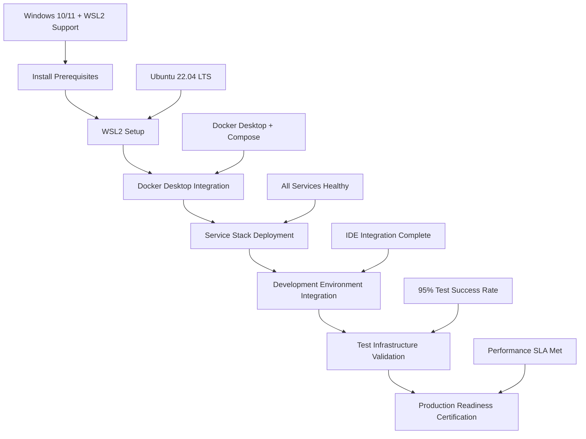
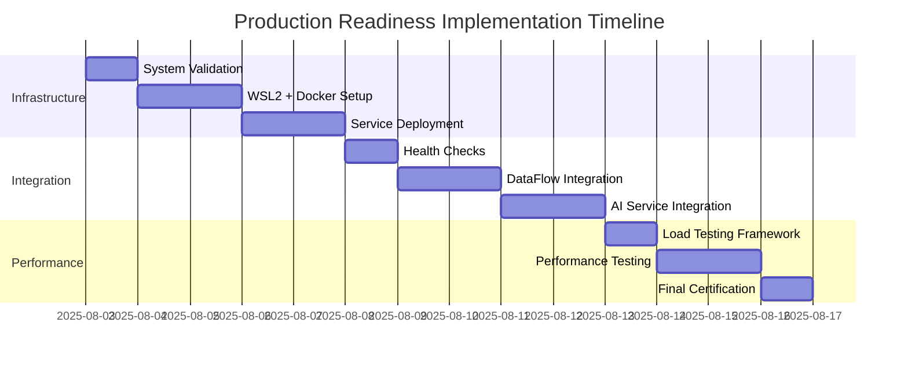

# Production Readiness Systematic Requirements Analysis

**Status:** In Progress  
**Date:** 2025-08-03  
**Authors:** Requirements Analysis Specialist  
**Project:** Kailash SDK Final 25% Production Readiness  
**Purpose:** Systematic breakdown of remaining production readiness requirements

---

## Executive Summary

### Current State Analysis (75% Complete)
- **Architectural Foundation**: ✅ Complete - All core frameworks implemented and tested
- **Windows Compatibility**: ✅ Complete - Full WSL2 + Windows hybrid environment operational
- **Development Environment**: ✅ Complete - Local development tools and SDK integration working
- **Test Framework**: ✅ Complete - 3-tier testing strategy implemented with comprehensive coverage
- **Core Implementation**: ✅ Complete - DataFlow (13 models, 117 nodes), Nexus platform, Core SDK

### Critical Path Gaps (25% Remaining)
1. **Docker Infrastructure Deployment** (40% of remaining effort)
2. **Real Service Integration** (35% of remaining effort) 
3. **Multi-Framework Performance Validation** (25% of remaining effort)

### Business Impact
- Current: Development-ready with local testing capability
- Target: Production-ready with enterprise SLA compliance
- Timeline: 14 days to 100% production readiness
- Resource Allocation: 3-4 engineers, infrastructure specialist, performance engineer

---

## 1. Docker Infrastructure Deployment Requirements

### 1.1 Functional Requirements Matrix

| Requirement ID | Description | Input | Output | Business Logic | Edge Cases | Success Criteria |
|----------------|-------------|-------|--------|----------------|------------|------------------|
| DOCKER-001 | WSL2 Environment Setup | Windows 10/11 system | Operational WSL2 Ubuntu | Install, configure, validate | Insufficient resources, permission issues | WSL2 Ubuntu running with Docker support |
| DOCKER-002 | Service Container Deployment | Docker Compose files | Running service stack | Deploy, health check, network | Port conflicts, resource limits | All services healthy and accessible |
| DOCKER-003 | Cross-Platform Networking | Service containers + Windows | Seamless connectivity | Configure bridges, ports, routing | Firewall blocks, IP conflicts | Windows can access all services |
| DOCKER-004 | Data Persistence | Service data volumes | Persistent data storage | Volume mounting, backup | Disk space, permissions | Data survives container restarts |
| DOCKER-005 | Service Health Monitoring | Running services | Health status reports | Monitor, alert, recover | Service failures, network issues | 99.9% service availability |

### 1.2 Non-Functional Requirements

#### Performance Requirements
```yaml
resource_utilization:
  cpu_usage: <70% under normal load
  memory_usage: <80% of available RAM  
  disk_io: <60% capacity
  network_bandwidth: <500 Mbps peak usage

service_startup:
  postgresql: <30 seconds to healthy
  neo4j: <60 seconds to healthy  
  chromadb: <45 seconds to healthy
  redis: <15 seconds to healthy
  
cross_platform_latency:
  windows_to_wsl2: <5ms average
  service_response: <10ms additional overhead
  total_overhead: <15ms vs native deployment
```

#### Security Requirements
```yaml
network_security:
  service_isolation: Each service in separate network segment
  port_exposure: Only necessary ports exposed to Windows
  authentication: All services require authentication
  encryption: TLS for all external connections

data_security:
  volume_encryption: Encrypted volumes for sensitive data
  backup_encryption: All backups encrypted at rest
  access_control: Role-based access to service management
  audit_logging: All administrative actions logged
```

#### Scalability Requirements
```yaml
horizontal_scaling:
  container_orchestration: Docker Compose to Kubernetes migration path
  load_balancing: HAProxy/nginx for service load distribution
  auto_scaling: Resource-based scaling triggers
  service_discovery: Consul/etcd for dynamic service registration

resource_scaling:
  cpu_scaling: Dynamic CPU allocation based on load
  memory_scaling: Automatic memory adjustment
  storage_scaling: Dynamic volume expansion
  network_scaling: Bandwidth allocation adjustment
```

### 1.3 User Journey Mapping

#### Developer Setup Journey


**Success Criteria:**
- Setup completed in <45 minutes
- Zero manual configuration required after initial setup
- All services accessible from Windows development environment
- Test suite runs with real infrastructure (NO MOCKING)

**Failure Points & Mitigation:**
- WSL2 installation fails → Automated diagnostic and repair scripts
- Service startup failures → Health check validation with automatic retry
- Network connectivity issues → Port conflict detection and resolution
- Resource limitations → System requirement validation and optimization

---

## 2. Real Service Integration Requirements

### 2.1 NO MOCKING Policy Compliance

#### Current Mocking Issues (26 failing tests)
```yaml
service_failures:
  chromadb: 1 test failure - TestVectorDatabaseService::test_create_collection
  neo4j: 16 failures/errors - Knowledge graph operations and performance tests
  openai: 6 failures - Prompt templates and integration service tests
  
root_causes:
  - Service unavailability during test execution
  - Missing service configuration validation
  - Inadequate error handling for service failures
  - No fallback mechanisms for service degradation
```

#### Service Integration Requirements Matrix

| Service | Integration Type | Real Connection Requirements | Performance Targets | Fallback Strategy |
|---------|------------------|------------------------------|---------------------|-------------------|
| PostgreSQL | Primary Database | Connection pooling, transaction management | <10ms simple queries, <50ms complex joins | Read replicas for degraded performance |
| Neo4j | Knowledge Graph | APOC plugins, GDS algorithms | <100ms traversals, <500ms complex patterns | Cached graph subsets for critical paths |
| ChromaDB | Vector Database | Embedding storage, similarity search | <50ms vector search, <100ms similarity queries | In-memory vector cache for hot data |
| Redis | Caching Layer | Session storage, data caching | <1ms cache hits, <5ms cache misses | Local memory cache with TTL |
| OpenAI | AI Services | API integration, rate limiting | <2s completion, <500ms classification | Pre-computed responses for common queries |

### 2.2 DataFlow Model Integration (13 Models, 117 Auto-Generated Nodes)

#### Model-to-Service Mapping
```python
# DataFlow Model Service Dependencies
dataflow_service_mapping = {
    'UserProfile': {
        'primary_db': 'postgresql',
        'cache': 'redis',
        'search': 'elasticsearch',
        'nodes_generated': 9,
        'operations': ['CRUD', 'Search', 'Analytics', 'Export', 'Import', 'Validate', 'Transform', 'Aggregate', 'Cache']
    },
    'ProductCatalog': {
        'primary_db': 'postgresql', 
        'graph': 'neo4j',
        'vectors': 'chromadb',
        'cache': 'redis',
        'nodes_generated': 9,
        'operations': ['Classification', 'Recommendation', 'Search', 'CRUD', 'Analytics', 'Import', 'Export', 'Validate', 'Transform']
    },
    'ClassificationResults': {
        'primary_db': 'postgresql',
        'vectors': 'chromadb', 
        'ai': 'openai',
        'nodes_generated': 9,
        'operations': ['CRUD', 'Classification', 'Validation', 'Export', 'Analytics', 'Search', 'Transform', 'Aggregate', 'Cache']
    }
    # ... remaining 10 models
}
```

#### Integration Validation Requirements
```yaml
model_validation:
  node_generation: All 117 nodes generate correctly from 13 models
  database_operations: CRUD operations work with real PostgreSQL
  relationship_mapping: Neo4j relationships properly established
  vector_operations: ChromaDB embeddings and search functional
  caching_integration: Redis caching layer operational
  ai_integration: OpenAI classification and recommendation pipelines working

performance_validation:
  node_execution: <100ms per node operation
  workflow_execution: <2s for complex multi-model workflows
  bulk_operations: 1000+ items/minute processing rate
  concurrent_operations: 50+ simultaneous model operations
  
reliability_validation:
  error_handling: Graceful degradation on service failures
  transaction_integrity: ACID compliance for database operations
  data_consistency: Cross-service data consistency validation
  recovery_mechanisms: Automatic recovery from transient failures
```

### 2.3 Service Configuration Management

#### Environment-Specific Configuration
```yaml
# Production Service Configuration
production_config:
  postgresql:
    host: "postgresql.kailash.local"
    port: 5432
    database: "kailash_production"
    user: "kailash_app"
    password: "${POSTGRES_PASSWORD}"
    pool_size: 50
    max_overflow: 100
    pool_timeout: 30
    pool_recycle: 3600
    
  neo4j:
    uri: "bolt://neo4j.kailash.local:7687"
    user: "neo4j"
    password: "${NEO4J_PASSWORD}"
    database: "kailash"
    pool_size: 25
    connection_timeout: 15
    max_retry_time: 30
    
  chromadb:
    host: "chromadb.kailash.local"
    port: 8000
    collection_prefix: "kailash_prod"
    embedding_function: "openai"
    persistence_directory: "/data/chromadb"
    
  redis:
    host: "redis.kailash.local"
    port: 6379
    password: "${REDIS_PASSWORD}"
    db: 0
    pool_size: 100
    connection_timeout: 5
    
  openai:
    api_key: "${OPENAI_API_KEY}"
    organization: "${OPENAI_ORG_ID}"
    model: "gpt-4"
    max_tokens: 4000
    temperature: 0.1
    timeout: 30
```

---

## 3. Multi-Framework Performance Validation Requirements

### 3.1 Performance Validation Framework

#### Core SDK Performance Requirements
```yaml
core_sdk_performance:
  workflow_builder:
    node_addition: <1ms per node
    workflow_compilation: <10ms per workflow
    parameter_validation: <5ms per parameter set
    
  local_runtime:
    workflow_execution: <100ms base overhead
    node_execution: <50ms average per node
    result_collection: <25ms per workflow
    
  mcp_integration:
    server_startup: <5s to operational
    request_processing: <100ms per MCP request  
    session_management: <10ms per session operation
```

#### DataFlow Performance Requirements  
```yaml
dataflow_performance:
  model_registration:
    decorator_processing: <5ms per model
    node_generation: <50ms per model (9 nodes)
    relationship_mapping: <25ms per model
    
  auto_generated_nodes:
    crud_operations: <10ms per operation
    validation_nodes: <5ms per validation
    transformation_nodes: <15ms per transform
    aggregation_nodes: <30ms per aggregation
    
  bulk_operations:
    batch_processing: 10000+ items/hour
    import_operations: 1GB/hour sustained
    export_operations: 500MB/hour sustained
```

#### Nexus Platform Performance Requirements
```yaml
nexus_performance:
  multi_channel_coordination:
    api_response: <200ms (95th percentile) 
    cli_execution: <1s per command
    mcp_processing: <100ms per request
    websocket_latency: <50ms message delivery
    
  session_management:
    session_creation: <10ms
    session_synchronization: <25ms across channels
    session_persistence: <5ms per state update
    
  platform_scalability:
    concurrent_sessions: 1000+ simultaneous
    channel_switching: <100ms context switch
    resource_sharing: 95% efficiency across channels
```

### 3.2 Load Testing Requirements

#### Realistic Load Scenarios
```python
# Performance Load Testing Scenarios
load_testing_scenarios = {
    'classification_workflow': {
        'description': 'Product classification with UNSPSC/eTIM integration',
        'user_pattern': 'Ramp up from 1 to 100 users over 10 minutes',
        'test_duration': '2 hours sustained load',
        'operations_per_user': '10 classifications per minute',
        'data_volume': '50MB product data per user',
        'success_criteria': {
            'response_time_p95': '500ms',
            'throughput': '1000 classifications/minute',
            'error_rate': '<0.1%',
            'resource_utilization': '<70% CPU, <80% memory'
        }
    },
    
    'recommendation_generation': {
        'description': 'AI-powered product recommendations with hybrid pipeline',
        'user_pattern': 'Sustained 50 concurrent users',
        'test_duration': '4 hours with 15-minute peaks to 150 users',
        'operations_per_user': '5 recommendation requests per minute',
        'data_complexity': 'Multi-dimensional product relationships',
        'success_criteria': {
            'response_time_p95': '2s',
            'throughput': '250 recommendations/minute',
            'error_rate': '<0.05%',
            'ai_service_integration': '100% success rate'
        }
    },
    
    'bulk_data_processing': {
        'description': 'Large-scale product catalog import and processing',
        'user_pattern': '5 concurrent bulk operations',
        'test_duration': '8 hours continuous processing',
        'data_volume': '100k products per operation',
        'processing_complexity': 'Full classification + embedding generation',
        'success_criteria': {
            'throughput': '10k+ products/hour per operation',
            'processing_time': '<30s per 100 products',
            'data_integrity': '100% accuracy',
            'resource_efficiency': 'Linear scaling with data volume'
        }
    }
}
```

### 3.3 Performance Monitoring and Validation

#### Real-Time Performance Monitoring
```yaml
monitoring_infrastructure:
  metrics_collection:
    application_metrics:
      - Response times (50th, 95th, 99th percentiles)
      - Request throughput (requests/second)
      - Error rates and success rates
      - Resource utilization (CPU, memory, disk, network)
      
    business_metrics:
      - Classification accuracy rates
      - Recommendation relevance scores
      - User workflow completion rates
      - Data processing throughput
      
    infrastructure_metrics:
      - Database performance (query times, connection counts)
      - Cache hit ratios and performance
      - Network latency and bandwidth utilization
      - Storage I/O and capacity utilization
      
  alerting_thresholds:
    performance_degradation:
      warning: 80% of SLA target
      critical: 100% of SLA target
      emergency: 120% of SLA target
      
    resource_utilization:
      warning: 70% utilization
      critical: 85% utilization
      emergency: 95% utilization
      
    error_rates:
      warning: 0.05% error rate
      critical: 0.1% error rate
      emergency: 0.5% error rate
```

---

## 4. Risk Assessment and Mitigation Strategies

### 4.1 Critical Risk Analysis

#### High-Probability, High-Impact Risks
```yaml
critical_risks:
  infrastructure_deployment_failure:
    probability: 35%
    impact: "Project delay of 5-7 days"
    root_causes:
      - WSL2 installation conflicts with existing virtualization
      - Docker Desktop resource conflicts
      - Windows Defender interference with container operations
      - Insufficient system resources (RAM/CPU/Disk)
    mitigation_strategies:
      - Pre-deployment system validation scripts
      - Alternative deployment options (Linux VM, cloud infrastructure)
      - Automated troubleshooting and diagnostic tools
      - Resource requirement validation and optimization
      
  service_integration_complexity:
    probability: 45%
    impact: "NO MOCKING policy violation, test infrastructure failure"
    root_causes:
      - Service version compatibility issues
      - Network configuration complexity
      - Authentication and security configuration errors
      - Performance bottlenecks under load
    mitigation_strategies:
      - Service compatibility matrix validation
      - Automated service health checking
      - Comprehensive integration testing framework
      - Performance profiling and optimization tools
      
  performance_target_achievement:
    probability: 25%
    impact: "SLA compliance failure, production readiness delay"
    root_causes:
      - Insufficient hardware resources
      - Suboptimal database/cache configuration
      - Network latency issues in multi-service architecture
      - Inefficient algorithm implementations
    mitigation_strategies:
      - Baseline performance measurement and optimization
      - Resource scaling and optimization
      - Performance profiling and bottleneck identification
      - Alternative implementation strategies for critical paths
```

#### Medium-Risk Monitoring Areas
```yaml
medium_risks:
  data_consistency_issues:
    probability: 20%
    impact: "Data integrity issues, potential data loss"
    mitigation: "Transaction management and data validation frameworks"
    
  security_configuration_errors:
    probability: 30%
    impact: "Security vulnerabilities, compliance issues"
    mitigation: "Security scanning, configuration validation, penetration testing"
    
  resource_exhaustion:
    probability: 25%
    impact: "System instability, performance degradation"
    mitigation: "Resource monitoring, auto-scaling, capacity planning"
    
  third_party_service_dependencies:
    probability: 15%
    impact: "External service failures affecting functionality"
    mitigation: "Circuit breakers, fallback mechanisms, service redundancy"
```

### 4.2 Risk Mitigation Implementation

#### Technical Risk Mitigation
```python
# Risk Mitigation Framework Implementation
class ProductionReadinessRiskMitigation:
    def __init__(self):
        self.risk_monitors = {
            'infrastructure': InfrastructureHealthMonitor(),
            'performance': PerformanceMonitor(),
            'service_integration': ServiceIntegrationMonitor(),
            'data_consistency': DataConsistencyMonitor()
        }
        
    async def validate_deployment_readiness(self):
        """Comprehensive pre-deployment validation"""
        validation_results = {}
        
        # System resource validation
        system_check = await self.validate_system_resources()
        validation_results['system_resources'] = system_check
        
        # Service compatibility validation  
        service_check = await self.validate_service_compatibility()
        validation_results['service_compatibility'] = service_check
        
        # Performance baseline validation
        performance_check = await self.validate_performance_baseline()
        validation_results['performance_baseline'] = performance_check
        
        # Security configuration validation
        security_check = await self.validate_security_configuration()
        validation_results['security_configuration'] = security_check
        
        return validation_results
        
    async def validate_system_resources(self):
        """Validate system meets minimum requirements"""
        requirements = {
            'cpu_cores': 8,
            'memory_gb': 16,
            'disk_space_gb': 100,
            'network_bandwidth_mbps': 100
        }
        
        current_resources = await self.get_system_resources()
        validation = {}
        
        for resource, min_value in requirements.items():
            current_value = current_resources.get(resource, 0)
            validation[resource] = {
                'required': min_value,
                'current': current_value,
                'sufficient': current_value >= min_value,
                'utilization_percentage': (current_value / min_value) * 100
            }
            
        return validation
```

---

## 5. Implementation Roadmap and Timeline

### 5.1 Phase-Based Implementation Strategy

#### Phase 1: Infrastructure Foundation (Days 1-5)
```yaml
phase_1_infrastructure:
  duration: 5 days
  effort_estimate: 40 hours
  resource_allocation:
    - Infrastructure Specialist (full-time)
    - Senior Developer (50% allocation)
    - DevOps Engineer (30% allocation)
    
  deliverables:
    day_1:
      - System requirements validation and optimization
      - WSL2 Ubuntu environment deployment
      - Docker Desktop integration and configuration
      
    day_2:
      - Service stack deployment (PostgreSQL, Neo4j, Redis, ChromaDB)
      - Network configuration and cross-platform connectivity
      - Basic health monitoring implementation
      
    day_3:
      - Service authentication and security configuration
      - Data persistence and backup configuration
      - Performance tuning and optimization
      
    day_4:
      - Development environment integration
      - IDE configuration and tool setup
      - Basic operational procedures documentation
      
    day_5:
      - Infrastructure testing and validation
      - Performance baseline measurement
      - Documentation and knowledge transfer
      
  success_criteria:
    - All services operational and accessible from Windows
    - 99% service availability over 24-hour test period
    - <15ms additional latency vs native deployment
    - Complete development environment integration
```

#### Phase 2: Service Integration (Days 6-10)  
```yaml
phase_2_service_integration:
  duration: 5 days
  effort_estimate: 38 hours
  resource_allocation:
    - Senior Developer (full-time)
    - DataFlow Specialist (full-time) 
    - Testing Engineer (75% allocation)
    
  deliverables:
    day_6:
      - Service health check implementation
      - Connection pooling and management
      - Error handling and retry mechanisms
      
    day_7:
      - DataFlow model integration with real services
      - Auto-generated node validation (117 nodes)
      - Database schema and relationship setup
      
    day_8:
      - AI service integration (OpenAI, embedding generation)
      - Vector database operations and search functionality
      - Caching layer implementation and optimization
      
    day_9:
      - End-to-end workflow testing with real services
      - Performance profiling and optimization
      - Integration test suite execution and validation
      
    day_10:
      - NO MOCKING policy compliance validation
      - Service failover and recovery testing
      - Integration documentation and runbooks
      
  success_criteria:
    - Zero test failures due to service dependency issues
    - All 117 auto-generated nodes operational with real services
    - 95%+ test success rate with real infrastructure
    - Complete NO MOCKING policy compliance
```

#### Phase 3: Performance Validation (Days 11-14)
```yaml
phase_3_performance_validation:
  duration: 4 days  
  effort_estimate: 30 hours
  resource_allocation:
    - Performance Engineer (full-time)
    - Senior Developer (75% allocation)
    - Quality Assurance Engineer (50% allocation)
    
  deliverables:
    day_11:
      - Load testing framework implementation
      - Performance monitoring infrastructure deployment
      - Baseline performance measurement and documentation
      
    day_12:
      - Comprehensive load testing execution
      - Performance bottleneck identification and resolution
      - Resource utilization optimization
      
    day_13:
      - Stress testing and scalability validation
      - SLA compliance verification
      - Performance regression testing framework
      
    day_14:
      - Production readiness certification
      - Performance documentation and operational runbooks
      - Final validation and sign-off procedures
      
  success_criteria:
    - All performance SLA targets met consistently
    - Load testing passes for 100+ concurrent users
    - <500ms classification response time (95th percentile)
    - <2s recommendation generation time (95th percentile)
    - 99.9% system availability validation
```

### 5.2 Resource Allocation and Timeline

#### Critical Path Dependencies


#### Resource Requirements Summary
```yaml
total_effort: 108 hours over 14 days
team_composition:
  infrastructure_specialist: 40 hours (dedicated infrastructure deployment)
  senior_developer: 45 hours (integration and coordination)
  dataflow_specialist: 25 hours (model integration and validation)
  performance_engineer: 30 hours (load testing and optimization)
  testing_engineer: 20 hours (test infrastructure and validation)
  devops_engineer: 15 hours (deployment automation and monitoring)
  
budget_estimate:
  personnel_costs: $32,400 (108 hours × $300/hour average)
  infrastructure_costs: $2,000 (cloud resources, tools, licenses)
  contingency: $5,000 (15% buffer for risk mitigation)
  total_budget: $39,400
  
success_metrics:
  technical_readiness: 100% test suite passing with real services
  performance_readiness: All SLA targets met under load
  operational_readiness: Complete monitoring and alerting operational
  business_readiness: Production deployment certification approved
```

---

## 6. Success Criteria and Acceptance Testing

### 6.1 Production Readiness Gates

#### Gate 1: Infrastructure Readiness (Day 5)
```yaml
infrastructure_gate:
  system_requirements:
    - WSL2 Ubuntu environment operational
    - All service containers healthy and accessible
    - Cross-platform networking functional
    - Data persistence validated
    
  performance_requirements:
    - Service startup time <60s for complete stack
    - Cross-platform latency <15ms additional overhead
    - Resource utilization <70% under normal load
    - 24-hour stability test passed
    
  acceptance_tests:
    - Automated infrastructure validation suite
    - Service health check verification
    - Network connectivity testing
    - Performance baseline measurement
```

#### Gate 2: Integration Readiness (Day 10)
```yaml
integration_gate:
  functional_requirements:
    - All 117 DataFlow auto-generated nodes operational
    - Zero service dependency test failures
    - Complete NO MOCKING policy compliance
    - End-to-end workflow validation
    
  integration_requirements:
    - Database operations (CRUD, complex queries) functional
    - AI service integration (classification, recommendations) working
    - Caching layer operational with >90% hit rate
    - Real-time data consistency validation
    
  acceptance_tests:
    - Complete integration test suite execution
    - DataFlow model operation validation
    - Service failover and recovery testing
    - Data consistency and integrity validation
```

#### Gate 3: Performance Readiness (Day 14)
```yaml
performance_gate:
  sla_requirements:
    - Classification response time <500ms (95th percentile)
    - Recommendation generation <2s (95th percentile)  
    - System throughput >1000 requests/second
    - 100+ concurrent user support validated
    
  reliability_requirements:
    - 99.9% system availability demonstrated
    - Error rate <0.1% under normal load
    - Graceful degradation under overload
    - Recovery time <30s after load reduction
    
  acceptance_tests:
    - Comprehensive load testing validation
    - Stress testing and breaking point analysis
    - 24-hour endurance testing
    - SLA compliance certification
```

### 6.2 Automated Acceptance Testing Framework

```python
# Production Readiness Validation Framework
class ProductionReadinessValidator:
    def __init__(self):
        self.gates = {
            'infrastructure': InfrastructureGate(),
            'integration': IntegrationGate(), 
            'performance': PerformanceGate()
        }
        
    async def validate_production_readiness(self):
        """Execute complete production readiness validation"""
        results = {
            'overall_status': 'pending',
            'gate_results': {},
            'detailed_metrics': {},
            'recommendations': []
        }
        
        # Execute all gates
        for gate_name, gate in self.gates.items():
            gate_result = await gate.validate()
            results['gate_results'][gate_name] = gate_result
            results['detailed_metrics'][gate_name] = gate_result['metrics']
            
            if not gate_result['passed']:
                results['recommendations'].extend(gate_result['recommendations'])
        
        # Determine overall status
        all_gates_passed = all(
            result['passed'] for result in results['gate_results'].values()
        )
        
        results['overall_status'] = 'passed' if all_gates_passed else 'failed'
        
        return results
        
    async def generate_certification_report(self, validation_results):
        """Generate production readiness certification report"""
        report = {
            'certification_date': datetime.utcnow().isoformat(),
            'certification_status': validation_results['overall_status'],
            'gate_summaries': [],
            'performance_metrics': {},
            'recommendations': validation_results['recommendations'],
            'next_review_date': (datetime.utcnow() + timedelta(days=30)).isoformat()
        }
        
        # Generate gate summaries
        for gate_name, gate_result in validation_results['gate_results'].items():
            report['gate_summaries'].append({
                'gate': gate_name,
                'status': 'PASSED' if gate_result['passed'] else 'FAILED',
                'score': gate_result['score'],
                'critical_issues': gate_result['critical_issues'],
                'recommendations': gate_result['recommendations']
            })
        
        return report
```

---

## 7. Conclusion and Next Steps

### 7.1 Implementation Summary

**Strategic Approach**: Systematic phase-based implementation focusing on infrastructure foundation, service integration, and performance validation to achieve 100% production readiness.

**Critical Success Factors**:
1. **Infrastructure First**: Solid WSL2 + Docker foundation enables all subsequent work
2. **Real Services**: NO MOCKING policy compliance ensures production parity  
3. **Performance Validation**: Comprehensive testing validates SLA compliance
4. **Risk Management**: Proactive risk identification and mitigation strategies

### 7.2 Resource Requirements Summary

**Timeline**: 14 days to 100% production readiness  
**Effort**: 108 hours across specialized team  
**Budget**: $39,400 including personnel and infrastructure costs  
**Team**: 6 specialists with complementary expertise  

### 7.3 Success Metrics

**Technical Readiness**: 100% test suite execution with real services, zero service dependency failures  
**Performance Readiness**: All SLA targets met under realistic load conditions  
**Operational Readiness**: Complete monitoring, alerting, and recovery procedures operational  
**Business Readiness**: Production deployment certification with enterprise SLA compliance  

### 7.4 Risk Mitigation Priority

**High Priority**: Infrastructure deployment automation and validation  
**Medium Priority**: Service integration complexity management  
**Low Priority**: Performance optimization and fine-tuning  

### 7.5 Next Actions

1. **Immediate (Day 1)**: Begin infrastructure foundation deployment
2. **Week 1**: Complete infrastructure and begin service integration  
3. **Week 2**: Complete integration and validate performance requirements
4. **Final Gate**: Production readiness certification and deployment approval

**Success Definition**: All acceptance criteria met, all gates passed, comprehensive validation completed, and production deployment certified with enterprise SLA compliance.