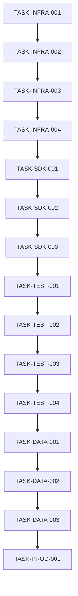

# Task Breakdown: Critical Infrastructure Remediation
## DATA-001: UNSPSC/ETIM Integration - 21-Day Recovery Plan

**Date:** 2025-08-02  
**Analyst:** Requirements Analysis Specialist  
**Total Duration:** 21 days  
**Status:** Ready for Todo Manager Implementation

---

## 🚨 EXECUTIVE SUMMARY

This document provides the complete task breakdown for recovering from the critical infrastructure collapse in DATA-001: UNSPSC/ETIM Integration. Tasks are organized by phase and priority, with specific acceptance criteria and validation checkpoints.

**Critical Path Dependencies:**
1. **Infrastructure Stabilization** (Days 1-7) - BLOCKS all other work
2. **SDK Compliance Foundation** (Days 8-12) - Required for testing  
3. **Testing Infrastructure** (Days 13-17) - Required for validation
4. **DataFlow Integration** (Days 18-20) - Core functionality
5. **Production Readiness** (Day 21) - Final validation

---

## 📋 PHASE 1: INFRASTRUCTURE STABILIZATION (Days 1-7)

### TASK-INFRA-001: WSL2 Environment Setup
**Priority:** 🔥 CRITICAL  
**Effort:** 4 hours  
**Assigned:** Lead Developer  
**Dependencies:** None  
**Due:** Day 1

**Description:**
Install and configure WSL2 Ubuntu environment for Kailash SDK compatibility. This resolves the fundamental `ModuleNotFoundError: No module named 'resource'` issue.

**Acceptance Criteria:**
- [ ] WSL2 Ubuntu 22.04 installed and running
- [ ] Python 3.11+ accessible in WSL2 environment  
- [ ] Kailash SDK imports without errors: `from kailash.workflow.builder import WorkflowBuilder`
- [ ] VS Code Remote-WSL extension connected and functional
- [ ] Repository accessible from both Windows and WSL2

**Validation Commands:**
```bash
# Run in WSL2
wsl --status
python3 --version
python3 -c "from kailash.workflow.builder import WorkflowBuilder; print('SDK compatible!')"
```

**Deliverables:**
- Working WSL2 Ubuntu 22.04 environment
- SDK compatibility validated
- VS Code integration functional

---

### TASK-INFRA-002: Docker Infrastructure Setup
**Priority:** 🔥 CRITICAL  
**Effort:** 6 hours  
**Assigned:** DevOps Specialist  
**Dependencies:** TASK-INFRA-001  
**Due:** Day 2

**Description:**
Configure Docker Desktop with WSL2 backend and deploy all required services for testing infrastructure. Establish real database connections needed for Tier 2/3 testing.

**Acceptance Criteria:**
- [ ] Docker Desktop with WSL2 backend configured
- [ ] PostgreSQL 15 running on port 5432 with test database
- [ ] Neo4j 5.3 with APOC running on ports 7474/7687
- [ ] ChromaDB running on port 8000
- [ ] Redis 7 running on port 6379
- [ ] All services accessible from WSL2 Python environment
- [ ] Health checks passing for all services

**Validation Commands:**
```bash
# Run in WSL2
docker ps --format "table {{.Names}}\t{{.Status}}\t{{.Ports}}"
python3 -c "import psycopg2; print('PostgreSQL accessible')"
python3 -c "import redis; r=redis.Redis(); r.ping(); print('Redis accessible')"
```

**Deliverables:**
- docker-compose.test.yml with all services
- Service health check scripts
- Database connection validation

---

### TASK-INFRA-003: Development Workflow Integration
**Priority:** 🔥 HIGH  
**Effort:** 4 hours  
**Assigned:** Lead Developer  
**Dependencies:** TASK-INFRA-001, TASK-INFRA-002  
**Due:** Day 3

**Description:**
Establish seamless development workflow between Windows host and WSL2 environment. Ensure team can develop efficiently with new environment.

**Acceptance Criteria:**
- [ ] VS Code Remote-WSL provides smooth editing experience
- [ ] Git operations work seamlessly across environments
- [ ] File synchronization working between Windows and WSL2
- [ ] Python debugging functional in VS Code
- [ ] Terminal integration working properly

**Validation Checklist:**
- [ ] Open project in VS Code Remote-WSL without errors
- [ ] Edit files and save successfully
- [ ] Run git commands (status, commit, push) successfully  
- [ ] Execute Python scripts with debugging
- [ ] Terminal commands respond quickly (<1s)

**Deliverables:**
- VS Code workspace configuration
- Development workflow documentation
- Performance benchmarks for key operations

---

### TASK-INFRA-004: Basic SDK Workflow Validation
**Priority:** 🔥 HIGH  
**Effort:** 2 hours  
**Assigned:** SDK Developer  
**Dependencies:** TASK-INFRA-001, TASK-INFRA-002  
**Due:** Day 4

**Description:**
Create and execute basic Kailash SDK workflow to validate end-to-end functionality in new environment. Ensure all core SDK patterns work.

**Acceptance Criteria:**
- [ ] WorkflowBuilder instantiates without errors
- [ ] Can add nodes using string-based pattern: `workflow.add_node("NodeName", "id", {})`
- [ ] LocalRuntime executes workflows: `runtime.execute(workflow.build())`
- [ ] Basic workflow execution completes successfully
- [ ] Results returned correctly from workflow execution

**Test Workflow:**
```python
from kailash.workflow.builder import WorkflowBuilder
from kailash.runtime.local import LocalRuntime

workflow = WorkflowBuilder()
workflow.add_node("PythonCodeNode", "test_node", {
    "code": "result = {'status': 'success', 'message': 'SDK working'}"
})

runtime = LocalRuntime()
results, run_id = runtime.execute(workflow.build())
assert results["test_node"]["status"] == "success"
```

**Deliverables:**
- Basic workflow validation script
- SDK functionality confirmation
- Performance baseline measurements

---

### TASK-INFRA-005: Team Environment Rollout  
**Priority:** 🔥 MEDIUM  
**Effort:** 8 hours  
**Assigned:** DevOps Specialist  
**Dependencies:** TASK-INFRA-001, TASK-INFRA-002, TASK-INFRA-003  
**Due:** Day 5-7

**Description:**
Roll out validated environment setup to entire development team. Provide training and support for transition to new development workflow.

**Acceptance Criteria:**
- [ ] All team members have working WSL2 environment
- [ ] All developers can import Kailash SDK without errors
- [ ] Docker services running for all team members
- [ ] VS Code Remote-WSL working for all developers
- [ ] Team training completed on new workflow

**Team Validation Checklist (per developer):**
- [ ] WSL2 installation successful
- [ ] SDK imports working
- [ ] Docker services accessible
- [ ] VS Code integration functional
- [ ] Basic workflow execution successful

**Deliverables:**
- Team setup documentation
- Troubleshooting guide
- Environment validation scripts
- Training materials

---

## 📋 PHASE 2: SDK COMPLIANCE FOUNDATION (Days 8-12)

### TASK-SDK-001: Node Registration Audit and Fixes
**Priority:** 🔥 HIGH  
**Effort:** 8 hours  
**Assigned:** SDK Compliance Specialist  
**Dependencies:** TASK-INFRA-004  
**Due:** Day 8-9

**Description:**
Audit all custom nodes in codebase and fix @register_node decorator violations. Ensure all nodes follow SDK registration standards.

**Acceptance Criteria:**
- [ ] Complete inventory of all custom nodes in src/ directory
- [ ] All nodes use @register_node() decorator with proper metadata
- [ ] Node registration metadata includes name, version, description
- [ ] No duplicate node registrations detected
- [ ] All registered nodes instantiate correctly

**Audit Scope:**
- `src/sales_assistant_mcp_server.py` - Check for custom nodes
- `src/new_project/nodes/` - All node implementations
- `src/dataflow_models.py` - DataFlow node generation
- Any other files with custom Node classes

**Validation Script:**
```python
# Audit script to find non-compliant nodes
import ast
import os

def find_node_classes(directory):
    violations = []
    for root, dirs, files in os.walk(directory):
        for file in files:
            if file.endswith('.py'):
                # Check for Node classes without @register_node
                pass
    return violations
```

**Deliverables:**
- Node compliance audit report
- Fixed node implementations
- Registration validation tests

---

### TASK-SDK-002: Parameter Pattern Implementation
**Priority:** 🔥 HIGH  
**Effort:** 10 hours  
**Assigned:** Pattern Expert  
**Dependencies:** TASK-SDK-001  
**Due:** Day 10-11

**Description:**
Implement 3-method parameter validation pattern across all nodes. Ensure parameters can be injected via direct config, workflow connections, and runtime parameters.

**Acceptance Criteria:**
- [ ] All nodes implement `get_parameters()` method returning `Dict[str, NodeParameter]`
- [ ] NodeParameter objects have proper type, required, default, description fields
- [ ] Parameter validation works for all three injection methods:
  - Direct configuration: `workflow.add_node("Node", "id", {"param": "value"})`
  - Workflow connections: Input mapping from other nodes
  - Runtime parameters: Injected at execution time
- [ ] Type constraints enforced (string, int, bool, list, dict, connection)
- [ ] Required field validation working

**Pattern Implementation:**
```python
from kailash.nodes.base import NodeParameter

class CompliantNode(Node):
    def get_parameters(self) -> Dict[str, NodeParameter]:
        return {
            "required_param": NodeParameter(
                name="required_param",
                type=str,
                required=True,
                description="Required parameter example"
            ),
            "optional_param": NodeParameter(
                name="optional_param", 
                type=int,
                required=False,
                default=42,
                description="Optional parameter with default"
            )
        }
```

**Deliverables:**
- Parameter pattern implementation for all nodes
- 3-method parameter validation tests
- Parameter documentation updates

---

### TASK-SDK-003: SecureGovernedNode Implementation
**Priority:** 🔥 HIGH  
**Effort:** 6 hours  
**Assigned:** Security Specialist  
**Dependencies:** TASK-SDK-002  
**Due:** Day 11

**Description:**
Implement SecureGovernedNode base class for nodes handling sensitive data. Add audit logging, parameter sanitization, and security validation.

**Acceptance Criteria:**
- [ ] SecureGovernedNode class extends base Node class
- [ ] Sensitive parameter sanitization ([REDACTED] in logs)
- [ ] Audit logging for all sensitive operations
- [ ] Parameter validation enforcement
- [ ] Security-focused error handling (no information leakage)
- [ ] Integration with existing audit infrastructure

**Security Features:**
```python
class SecureGovernedNode(Node):
    def validate_parameters(self, inputs: Dict[str, Any]) -> Dict[str, Any]:
        # Validate all parameters against schema
        pass
    
    def sanitize_for_logging(self, data: Dict[str, Any]) -> Dict[str, Any]:
        # Replace sensitive values with [REDACTED]
        pass
    
    def log_audit_event(self, event_type: str, user_id: int, metadata: Dict):
        # Log to audit system
        pass
```

**Deliverables:**
- SecureGovernedNode base class implementation
- Audit logging infrastructure
- Security validation tests
- Sensitive data sanitization

---

### TASK-SDK-004: Workflow Pattern Compliance
**Priority:** 🔥 MEDIUM  
**Effort:** 4 hours  
**Assigned:** Workflow Specialist  
**Dependencies:** TASK-SDK-001  
**Due:** Day 12

**Description:**
Fix all workflow instantiation patterns to use string-based node references and proper runtime execution. Eliminate deprecated patterns.

**Acceptance Criteria:**
- [ ] All workflows use `workflow.add_node("NodeName", "id", {})` pattern
- [ ] No direct node object instantiation in workflows
- [ ] All workflow execution uses `runtime.execute(workflow.build())` pattern
- [ ] No deprecated execution patterns remain (e.g., `workflow.execute(runtime)`)
- [ ] String-based node references validated

**Pattern Fixes:**
```python
# BEFORE (Non-Compliant)
workflow = WorkflowBuilder()
node = CustomNode()
workflow.add_node(node, "node_id", {})
result = workflow.execute(runtime)

# AFTER (SDK Compliant)  
workflow = WorkflowBuilder()
workflow.add_node("CustomNode", "node_id", {})
runtime = LocalRuntime()
results, run_id = runtime.execute(workflow.build())
```

**Deliverables:**
- Fixed workflow patterns across codebase
- Workflow execution validation
- Pattern compliance tests

---

## 📋 PHASE 3: TESTING INFRASTRUCTURE (Days 13-17)

### TASK-TEST-001: Docker Test Environment
**Priority:** 🔥 CRITICAL  
**Effort:** 6 hours  
**Assigned:** Testing Infrastructure Specialist  
**Dependencies:** TASK-INFRA-002  
**Due:** Day 13

**Description:**
Establish comprehensive Docker test environment with all required services for 3-tier testing strategy. Ensure real infrastructure connections for Tier 2/3 tests.

**Acceptance Criteria:**
- [ ] docker-compose.test.yml with all services configured
- [ ] PostgreSQL test database with schema and sample data
- [ ] Neo4j test instance with APOC plugins
- [ ] ChromaDB test instance with vector capabilities
- [ ] Redis test instance for caching
- [ ] All services isolated for testing (no production data)
- [ ] Automated service startup and health checks

**Service Configuration:**
```yaml
# docker-compose.test.yml
version: '3.8'
services:
  postgres-test:
    image: postgres:15
    environment:
      POSTGRES_DB: horme_test
      POSTGRES_USER: test_user
      POSTGRES_PASSWORD: test_pass
    ports:
      - "5433:5432"
    
  neo4j-test:
    image: neo4j:5.3
    environment:
      NEO4J_AUTH: neo4j/test_password
      NEO4J_PLUGINS: '["apoc"]'
    ports:
      - "7475:7474"
      - "7688:7687"
```

**Deliverables:**
- Complete Docker test environment
- Service health check scripts
- Test data initialization scripts
- Environment isolation validation

---

### TASK-TEST-002: Tier 1 Unit Tests Implementation
**Priority:** 🔥 HIGH  
**Effort:** 8 hours  
**Assigned:** TDD Implementation Specialist  
**Dependencies:** TASK-SDK-003  
**Due:** Day 14

**Description:**
Implement comprehensive Tier 1 unit tests for all SDK compliance patterns. Tests should execute quickly (<1s each) and use mocks for external dependencies.

**Acceptance Criteria:**
- [ ] TestRegisterNodeDecorator class with 15+ test methods
- [ ] TestSecureGovernedNode class with 12+ test methods  
- [ ] TestParameterValidation class with 18+ test methods
- [ ] TestNodeExecutionPatterns class with 10+ test methods
- [ ] TestStringBasedNodeConfigurations class with 8+ test methods
- [ ] All tests execute in <1 second each
- [ ] 95%+ code coverage for compliance patterns
- [ ] No external service dependencies in unit tests

**Test Structure:**
```python
class TestRegisterNodeDecorator:
    def test_register_node_decorator_follows_sdk_standards(self):
        # Test @register_node decorator compliance
        pass
    
    def test_register_node_works_with_minimal_parameters(self):
        # Test minimal registration patterns
        pass
```

**Deliverables:**
- Complete unit test suite (45+ test methods)
- Test fixtures and utilities
- Coverage reporting configuration
- Performance benchmarks for test execution

---

### TASK-TEST-003: Tier 2 Integration Tests Implementation
**Priority:** 🔥 HIGH  
**Effort:** 10 hours  
**Assigned:** Integration Testing Specialist  
**Dependencies:** TASK-TEST-001, TASK-SDK-003  
**Due:** Day 15-16

**Description:**
Implement Tier 2 integration tests using real database connections. NO MOCKING allowed for database operations. Tests validate multi-service interactions.

**Acceptance Criteria:**
- [ ] TestRealDatabaseConnections with actual PostgreSQL operations
- [ ] TestWorkflowExecutionWithRealServices with multi-node workflows
- [ ] TestPerformanceWithRealServices with load testing
- [ ] All tests use real database connections (no mocks)
- [ ] Tests execute in <5 seconds each
- [ ] Database cleanup between tests
- [ ] Connection pooling validated
- [ ] Transaction handling verified

**Integration Test Examples:**
```python
class TestRealDatabaseConnections:
    def test_postgresql_crud_operations(self, real_db_connection):
        # Test actual database operations
        pass
    
    def test_neo4j_graph_operations(self, neo4j_connection):
        # Test actual graph database operations  
        pass
```

**Deliverables:**
- Integration test suite with real database operations
- Database test fixtures and cleanup
- Performance benchmarks with real infrastructure
- Connection management validation

---

### TASK-TEST-004: Tier 3 E2E Tests Implementation
**Priority:** 🔥 MEDIUM  
**Effort:** 8 hours  
**Assigned:** E2E Testing Specialist  
**Dependencies:** TASK-TEST-003  
**Due:** Day 16-17

**Description:**
Implement Tier 3 end-to-end tests covering complete business workflows. Tests should validate entire system functionality with realistic data volumes.

**Acceptance Criteria:**
- [ ] TestCompleteSalesWorkflow with 4-node workflow
- [ ] TestDocumentProcessingAndRAG with AI integration
- [ ] TestMCPServerIntegration with actual MCP server
- [ ] TestBusinessProcessCompliance with audit validation
- [ ] Tests execute in <10 seconds each
- [ ] Realistic data volumes (1000+ records)
- [ ] Performance SLA validation (<2s workflows)
- [ ] Complete business scenario coverage

**E2E Test Scenarios:**
```python
class TestCompleteSalesWorkflow:
    def test_complete_quote_generation_workflow(self):
        # Customer lookup → Product recommendation → Quote calculation → Database storage
        pass
    
    def test_performance_under_realistic_load(self):
        # Test with 100+ concurrent operations
        pass
```

**Deliverables:**  
- E2E test suite covering business workflows
- Performance validation with SLA monitoring
- Realistic test data generation
- Business process compliance validation

---

### TASK-TEST-005: Test Execution and Reporting
**Priority:** 🔥 MEDIUM  
**Effort:** 4 hours  
**Assigned:** Test Automation Specialist  
**Dependencies:** TASK-TEST-002, TASK-TEST-003, TASK-TEST-004  
**Due:** Day 17

**Description:**
Implement comprehensive test execution framework with accurate reporting. Eliminate false progress reporting - all results must reflect actual test execution.

**Acceptance Criteria:**
- [ ] pytest configuration for all test tiers
- [ ] Test execution runner with proper reporting
- [ ] Coverage reporting with accurate metrics
- [ ] Performance benchmarking integrated
- [ ] HTML test reports generated
- [ ] CI/CD integration prepared
- [ ] No false positive results (all results reflect actual execution)

**Test Runner Configuration:**
```python
# pytest.ini
[tool:pytest] 
testpaths = tests
python_files = test_*.py
python_classes = Test*
python_functions = test_*
addopts = --tb=short --cov=src --cov-report=html --cov-report=xml
```

**Deliverables:**
- Complete test execution framework
- Accurate test reporting (no false claims)
- Coverage and performance metrics
- CI/CD integration configuration

---

## 📋 PHASE 4: DATAFLOW INTEGRATION VALIDATION (Days 18-20)

### TASK-DATA-001: DataFlow Model Compliance Audit
**Priority:** 🔥 HIGH  
**Effort:** 6 hours  
**Assigned:** DataFlow Specialist  
**Dependencies:** TASK-SDK-004  
**Due:** Day 18

**Description:**
Audit all DataFlow models to ensure 117 auto-generated nodes remain functional after SDK compliance fixes. Validate @db.model decorator usage.

**Acceptance Criteria:**
- [ ] All DataFlow models use @db.model decorator properly
- [ ] 117 auto-generated nodes still generate correctly
- [ ] Node generation follows SDK compliance patterns
- [ ] @register_node decorator applied to generated nodes
- [ ] Parameter patterns correctly implemented in generated nodes
- [ ] Database schema generation working

**DataFlow Pattern Validation:**
```python
from kailash_dataflow import db

@db.model
class Product(db.Model):
    id = db.Column(db.Integer, primary_key=True)
    name = db.Column(db.String(255), nullable=False)
    category = db.Column(db.String(100))
    
# Should generate 9 nodes per model:
# ProductCreateNode, ProductReadNode, ProductUpdateNode, etc.
```

**Deliverables:**
- DataFlow model compliance audit report
- Fixed model implementations
- Node generation validation
- Database schema verification

---

### TASK-DATA-002: UNSPSC/ETIM Classification Testing
**Priority:** 🔥 HIGH  
**Effort:** 8 hours  
**Assigned:** Classification System Specialist  
**Dependencies:** TASK-DATA-001, TASK-TEST-003  
**Due:** Day 19

**Description:**
Test UNSPSC and ETIM classification systems with real data. Validate performance requirements (<500ms) and accuracy standards.

**Acceptance Criteria:**
- [ ] UNSPSC classification system operational
- [ ] ETIM classification system operational  
- [ ] Dual classification workflows functional
- [ ] Classification response time <500ms for single queries
- [ ] Batch classification performance acceptable
- [ ] Multi-language support working (ETIM)
- [ ] Classification accuracy >95% for test dataset

**Performance Testing:**
```python
import time

def test_classification_performance():
    start_time = time.time()
    
    # Test UNSPSC classification
    unspsc_result = classify_product_unspsc(test_product_data)
    
    # Test ETIM classification  
    etim_result = classify_product_etim(test_product_data)
    
    total_time = time.time() - start_time
    assert total_time < 0.5  # <500ms requirement
```

**Deliverables:**
- Classification system functionality validation
- Performance benchmarks meeting SLA requirements
- Accuracy testing with sample datasets
- Multi-language support verification

---

### TASK-DATA-003: Integration Performance Optimization
**Priority:** 🔥 MEDIUM  
**Effort:** 6 hours  
**Assigned:** Performance Engineering Specialist  
**Dependencies:** TASK-DATA-002  
**Due:** Day 20

**Description:**
Optimize DataFlow and classification system performance to meet all SLA requirements. Focus on database queries, caching, and workflow execution.

**Acceptance Criteria:**
- [ ] Product classification queries <500ms
- [ ] Complete recommendation workflows <2s
- [ ] Safety compliance checks <1s
- [ ] Knowledge graph queries <800ms
- [ ] Vector similarity searches <300ms
- [ ] Database connection pooling optimized
- [ ] Redis caching implemented for frequent queries

**Performance Targets:**
```yaml
SLA Requirements:
  - Product search: < 500ms
  - Recommendation generation: < 2s  
  - Safety compliance check: < 1s
  - Knowledge graph queries: < 800ms
  - Vector similarity search: < 300ms
```

**Deliverables:**
- Performance optimization implementation
- SLA compliance validation
- Caching strategy implementation
- Database query optimization

---

## 📋 PHASE 5: PRODUCTION READINESS (Day 21)

### TASK-PROD-001: Gold Standards Compliance Validation
**Priority:** 🔥 CRITICAL  
**Effort:** 8 hours  
**Assigned:** Gold Standards Validator  
**Dependencies:** All previous tasks  
**Due:** Day 21

**Description:**
Complete validation against Kailash SDK Gold Standards. Ensure 100% compliance score before production deployment approval.

**Acceptance Criteria:**
- [ ] 100% nodes use @register_node decorator with proper metadata
- [ ] 100% parameter patterns follow 3-method approach
- [ ] All sensitive operations use SecureGovernedNode
- [ ] All workflows use string-based node references
- [ ] All execution uses runtime.execute(workflow.build()) pattern
- [ ] Performance SLAs met for all operations
- [ ] Security audit requirements satisfied
- [ ] Documentation accuracy validated

**Compliance Checklist:**
```python
# Automated compliance validation
def validate_sdk_compliance():
    violations = []
    
    # Check @register_node usage
    # Check parameter patterns
    # Check SecureGovernedNode usage
    # Check workflow patterns
    # Check execution patterns
    
    return len(violations) == 0  # Must be zero violations
```

**Deliverables:**
- Complete compliance validation report
- 100% SDK compliance score
- Security audit completion
- Production readiness certification

---

## 🎯 TASK DEPENDENCIES AND CRITICAL PATH

### Critical Path Analysis


### Parallel Work Opportunities
- TASK-INFRA-005 can run parallel with TASK-SDK-001
- TASK-TEST-002, TASK-TEST-003 can have some overlap
- TASK-DATA-001 can start before TASK-TEST-005 completion

### Resource Allocation
- **Week 1**: Infrastructure focus (all team members)
- **Week 2**: SDK compliance (specialists + infrastructure support)
- **Week 3**: Testing and validation (testing specialists + developers)

---

## ✅ VALIDATION AND ACCEPTANCE CRITERIA

### Phase Completion Criteria

#### Phase 1 Complete (Infrastructure Stabilization)
- [ ] All team members have working WSL2 environment
- [ ] Kailash SDK imports successful for all developers
- [ ] Docker services running and accessible
- [ ] Basic workflow execution validated
- [ ] Development workflow efficient and fast

#### Phase 2 Complete (SDK Compliance Foundation)  
- [ ] All nodes use @register_node decorator
- [ ] Parameter patterns follow 3-method approach
- [ ] SecureGovernedNode implemented for sensitive operations
- [ ] Workflow patterns comply with SDK standards
- [ ] All compliance tests passing

#### Phase 3 Complete (Testing Infrastructure)
- [ ] 3-tier test strategy fully implemented
- [ ] 95+ test cases executing successfully (not just existing)
- [ ] Real infrastructure connections in Tier 2/3 tests
- [ ] Performance benchmarks established and meeting SLAs
- [ ] Test reporting accurate (no false claims)

#### Phase 4 Complete (DataFlow Integration)
- [ ] 117 DataFlow auto-generated nodes functional
- [ ] UNSPSC/ETIM classification systems operational
- [ ] Performance requirements met (<500ms classification)
- [ ] Multi-tenancy features working
- [ ] Integration tests passing

#### Phase 5 Complete (Production Readiness)
- [ ] 100% SDK compliance score achieved
- [ ] All performance SLAs validated
- [ ] Security audit completed and passed
- [ ] Documentation accuracy verified
- [ ] Production deployment approved

---

## 🚨 RISK MITIGATION TASKS

### High-Risk Mitigation Tasks
- **RISK-MIT-001**: WSL2 installation validation scripts (Day 1)
- **RISK-MIT-002**: Docker service health monitoring (Day 2)
- **RISK-MIT-003**: Performance baseline establishment (Day 4)
- **RISK-MIT-004**: Team training and support materials (Day 5-7)

### Contingency Planning Tasks
- **CONT-001**: Cloud development environment fallback preparation
- **CONT-002**: Simplified single-service testing setup
- **CONT-003**: Performance optimization emergency procedures
- **CONT-004**: Rollback procedures for each phase

---

## 📊 SUCCESS METRICS AND KPIs

### Technical KPIs
- **Infrastructure Uptime**: >99% for development services
- **Test Execution Success**: 100% of tests executable (not just existing)
- **Performance Compliance**: 100% of SLAs met
- **SDK Compliance Score**: 100% (zero violations)

### Development KPIs  
- **Environment Setup Time**: <4 hours per developer
- **Test Suite Execution Time**: <30 minutes for complete suite
- **Development Velocity**: Maintain current story point velocity
- **Issue Resolution Time**: <24h for environment issues

### Business KPIs
- **Time to Recovery**: 21 days maximum
- **Team Productivity**: No decrease in development velocity
- **Quality Assurance**: Real infrastructure testing operational
- **Production Readiness**: Deployment approval achieved

---

## 🛠️ IMMEDIATE ACTIONS REQUIRED

### Day 1 Immediate Actions
1. **Start TASK-INFRA-001**: WSL2 environment setup for lead developer
2. **Prepare TASK-INFRA-002**: Docker infrastructure planning
3. **Resource Assignment**: Allocate specialists to critical path tasks
4. **Communication**: Notify stakeholders of remediation plan start

### Week 1 Success Gates
- **Gate 1**: WSL2 environment working for lead developer (End Day 1)
- **Gate 2**: Docker services running and accessible (End Day 2)  
- **Gate 3**: Development workflow operational (End Day 3)
- **Gate 4**: Basic SDK functionality validated (End Day 4)
- **Gate 5**: Team environment rollout complete (End Day 7)

### Command Examples for Todo Manager
```bash
# Example task creation commands for todo-manager
create_todo "TASK-INFRA-001: WSL2 Environment Setup" --priority critical --effort 4h --due "Day 1"
create_todo "TASK-INFRA-002: Docker Infrastructure Setup" --priority critical --effort 6h --due "Day 2" --depends "TASK-INFRA-001"
create_todo "TASK-SDK-001: Node Registration Audit" --priority high --effort 8h --due "Day 8-9" --depends "TASK-INFRA-004"
```

---

## 🎯 CONCLUSION

This task breakdown provides the complete roadmap for recovering from the critical infrastructure collapse. The 21-day timeline is realistic but requires immediate action and focused execution.

**Success depends on:**
- Immediate environment setup (Days 1-2)
- Systematic SDK compliance fixes (Days 8-12)
- Real infrastructure testing implementation (Days 13-17)
- Performance validation and optimization (Days 18-20)
- Final compliance validation (Day 21)

**Critical Success Factors:**
- Team adoption of new development environment
- No shortcuts on SDK compliance patterns
- Real infrastructure testing (no false reporting)
- Performance optimization meeting all SLAs

**Ready for Implementation:** All tasks defined with clear acceptance criteria, dependencies, and validation checkpoints. Todo manager can now create trackable todo items for each task with proper priority, effort estimation, and dependency management.

**Implementation Status: TASK BREAKDOWN COMPLETE ✅**  
**Next Steps:** Todo manager implementation, team coordination, immediate execution start