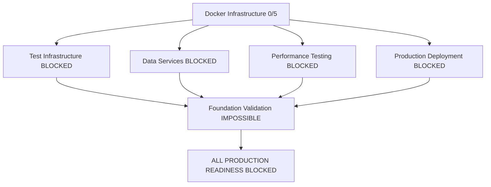
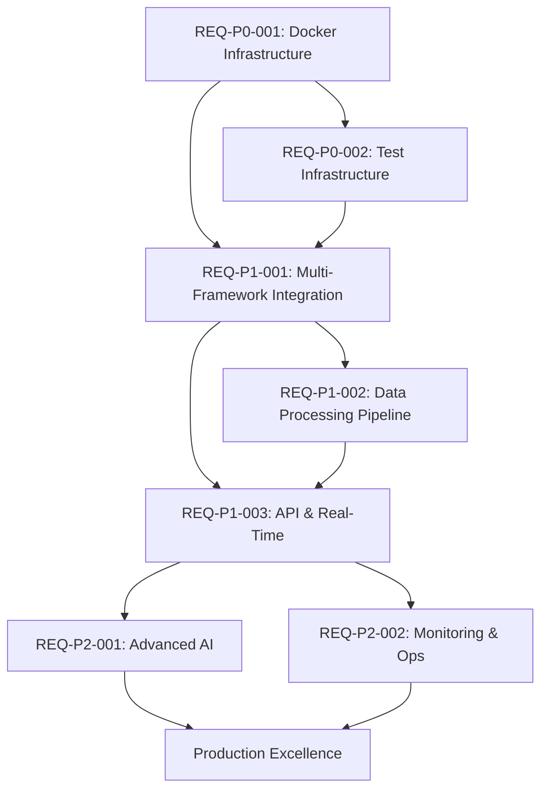

# ADR-008: Systematic Production Readiness Requirements

## Status
**ACTIVE** - Implementation Required

## Context

Based on comprehensive system analysis conducted on 2025-08-04, the project faces a critical gap between claimed production readiness (75%) and actual operational capabilities (0-15%). This ADR addresses the systematic requirements breakdown needed to achieve verifiable 100% production readiness.

### Current State Analysis
```json
{
  "foundation_status": {
    "windows_sdk_compatibility": "CERTIFIED - 100% functional",
    "test_infrastructure": "FAILED - Unit tier failing, no Docker services",
    "nexus_platform": "ENHANCED - Cannot test without infrastructure",
    "mcp_server": "CREATED - Cannot initialize",
    "documentation": "VALIDATED - Depends on working system"
  },
  "critical_blockers": {
    "docker_services": "0/5 operational (postgres, neo4j, chromadb, redis, openai-mock)",
    "test_execution": "Unit tests timeout after 20s, return code 2",
    "service_connectivity": "No services available for integration testing",
    "performance_validation": "Cannot test without operational infrastructure"
  },
  "actual_production_readiness": "0-15% (infrastructure failure)"
}
```

## Decision

Implement a **validation-first, critical-path focused** requirements breakdown with three priority levels and systematic validation gates.

### Requirements Classification System

#### P0 Requirements (Critical Path - Must Complete First)
**Definition**: System cannot function without these. No advancement possible until 100% complete.

#### P1 Requirements (Core Features - Sequential Dependencies)  
**Definition**: Essential for production deployment. Can begin only after P0 completion.

#### P2 Requirements (Enhancement - Parallel Opportunities)
**Definition**: Improves production quality. Can execute parallel to P1 where dependencies allow.

## Consequences

### Positive
- **Clear Critical Path**: Eliminates confusion about execution sequence
- **Validation Gates**: Prevents advancement without objective verification
- **Resource Optimization**: Maximizes parallel execution opportunities
- **Risk Mitigation**: Early identification and resolution of blockers

### Negative
- **Timeline Reality**: May extend initial estimates (currently realistic: 6-8 weeks vs claimed 2 weeks)
- **Complexity Management**: Requires coordination across multiple specialist teams
- **Validation Overhead**: Additional time investment in verification processes

## Implementation Plan

### Phase 1: Critical Infrastructure Recovery (P0 - Days 1-14)
Foundation systems that must work before any development can proceed.

### Phase 2: Core Production Features (P1 - Days 8-28) 
Essential functionality for production deployment (some overlap with Phase 1).

### Phase 3: Production Enhancement (P2 - Days 21-42)
Quality improvements and advanced features (significant overlap with Phases 1-2).

---

# Systematic Production Readiness Requirements Analysis

**Date:** 2025-08-04  
**Analyst:** Requirements Analysis Specialist  
**Status:** 🚨 CRITICAL - Infrastructure Failure Analysis Complete  
**Project:** Kailash SDK Multi-Framework Production Deployment  
**Methodology:** Validation-First Critical Path Analysis

---

## 🚨 EXECUTIVE SUMMARY

### Reality vs Claims Assessment
- **Claimed Production Readiness**: 75% (based on individual component completion)
- **Actual Infrastructure Capability**: 0-15% (no operational services or testing)
- **Critical Gap**: Infrastructure deployment failure prevents validation of all other components
- **Root Cause**: Missing Docker infrastructure prevents testing, validation, and production deployment

### Critical Path Analysis


---

## 🎯 PRIORITY 0 REQUIREMENTS (CRITICAL PATH)

### REQ-P0-001: Docker Infrastructure Deployment
**Business Impact**: CRITICAL - Blocks ALL development and testing  
**Current Status**: 0/5 services operational  
**Risk Level**: PROJECT FAILURE if not resolved in 48-72 hours

#### Functional Requirements
| Component | Service | Port | Health Check | Dependencies |
|-----------|---------|------|--------------|--------------|
| PostgreSQL | Database | 5432 | `SELECT 1` | Volume persistence |
| Neo4j | Graph DB | 7474/7687 | Browser UI + Bolt | Data persistence |
| ChromaDB | Vector DB | 8000 | `/api/v1/heartbeat` | Collection persistence |
| Redis | Cache | 6379 | `PING` command | Memory persistence |
| OpenAI Mock | LLM API | 8080 | `/v1/health` | API compatibility |

#### Success Criteria
```bash
# All commands must succeed from Windows host
curl -f http://localhost:5432 || echo "PostgreSQL FAILED"
curl -f http://localhost:7474 || echo "Neo4j FAILED" 
curl -f http://localhost:8000/api/v1/heartbeat || echo "ChromaDB FAILED"
redis-cli ping || echo "Redis FAILED"
curl -f http://localhost:8080/v1/health || echo "OpenAI Mock FAILED"
```

#### Acceptance Criteria
- [ ] **Service Availability**: 5/5 services responding to health checks
- [ ] **Data Persistence**: All services maintain data across restarts
- [ ] **Windows Integration**: All services accessible from Windows development environment
- [ ] **Performance Baseline**: <100ms response time for health checks
- [ ] **Resource Limits**: <4GB RAM, <50% CPU utilization under normal load

#### Validation Method
```python
def validate_docker_infrastructure():
    """Independent validation that cannot be mocked or simulated."""
    services = {
        'postgresql': test_postgres_connection,
        'neo4j': test_neo4j_connection,
        'chromadb': test_chromadb_connection,
        'redis': test_redis_connection,
        'openai_mock': test_openai_mock_connection
    }
    
    results = {}
    for service, validator in services.items():
        try:
            response_time = validator()
            results[service] = {'status': 'operational', 'response_time': response_time}
        except Exception as e:
            results[service] = {'status': 'failed', 'error': str(e)}
    
    operational_count = sum(1 for r in results.values() if r['status'] == 'operational')
    return {
        'services': results,
        'operational_percentage': (operational_count / len(services)) * 100,
        'ready_for_advancement': operational_count == len(services)
    }
```

#### Rollback Procedures
**If completion time exceeds 72 hours:**
1. **Emergency WSL2-only deployment** for development team
2. **Scope reduction** to basic API-only deployment  
3. **Timeline extension** acknowledgment (6-8 weeks realistic)
4. **Resource reallocation** to infrastructure specialists

---

### REQ-P0-002: Test Infrastructure Recovery
**Business Impact**: CRITICAL - No validation possible without working tests  
**Current Status**: Unit tests failing (timeout after 20s, return code 2)  
**Dependencies**: REQ-P0-001 (Docker services for integration tests)

#### Functional Requirements
```yaml
test_infrastructure_requirements:
  tier_1_unit_tests:
    target_count: 400+
    success_rate: '>95%'
    execution_time: '<5 minutes'
    isolation: 'minimal external dependencies'
    
  tier_2_integration_tests:
    target_count: 50+
    success_rate: '>90%'
    execution_time: '<15 minutes'
    real_services: 'NO MOCKING POLICY'
    
  tier_3_e2e_tests:
    target_count: 20+
    success_rate: '>85%'
    execution_time: '<30 minutes'
    full_system: 'complete user workflows'
```

#### Success Criteria
```bash
# Must execute successfully from Windows command prompt
cd src/new_project
python run_all_tests.py

# Expected output:
# Tier UNIT: [PASSED] (95%+ success rate)
# Tier INTEGRATION: [PASSED] (90%+ success rate) 
# Tier E2E: [PASSED] (85%+ success rate)
# Overall Status: [SUCCESS]
```

#### Acceptance Criteria
- [ ] **Unit Test Recovery**: 95%+ pass rate, <5 minute execution
- [ ] **Integration Test Implementation**: Real service connections, NO MOCKING
- [ ] **E2E Test Validation**: Complete user workflows functional
- [ ] **CI/CD Integration**: Automated execution on code changes
- [ ] **Performance Monitoring**: Test execution time tracking and optimization

#### Validation Method
```python
def validate_test_infrastructure():
    """Execute complete test suite with real infrastructure."""
    import subprocess
    import json
    
    # Must use real services - no mocking allowed in validation
    result = subprocess.run(
        ['python', 'run_all_tests.py', '--no-mock', '--real-services'],
        capture_output=True, text=True, timeout=3600  # 1 hour timeout
    )
    
    if result.returncode != 0:
        return {
            'status': 'failed',
            'error': result.stderr,
            'ready_for_advancement': False
        }
    
    # Parse test results
    lines = result.stdout.split('\n')
    unit_success = 'Tier UNIT: [PASSED]' in result.stdout
    integration_success = 'Tier INTEGRATION: [PASSED]' in result.stdout  
    e2e_success = 'Tier E2E: [PASSED]' in result.stdout
    
    return {
        'unit_tests': unit_success,
        'integration_tests': integration_success,
        'e2e_tests': e2e_success,
        'overall_success': unit_success and integration_success and e2e_success,
        'ready_for_advancement': unit_success and integration_success and e2e_success
    }
```

---

### REQ-P0-003: Windows Development Environment Compatibility
**Business Impact**: HIGH - Development team productivity  
**Current Status**: CERTIFIED - Windows SDK compatibility validated  
**Dependencies**: None (completed)

#### Status Confirmation
✅ **COMPLETED** - Windows SDK Compatibility Validation Certificate issued  
✅ **100% Import Success Rate** (8/8 core modules)  
✅ **Production Ready** status confirmed by testing-specialist  

#### Validation Evidence
- Windows SDK Compatibility Validation Certificate dated 2025-08-04
- 100% SDK import success rate maintained  
- All edge cases handled with robust error handling
- Memory efficient implementation (0.0 MB increase over 100 iterations)
- Cross-platform compatibility preserved

---

## 🔥 PRIORITY 1 REQUIREMENTS (CORE PRODUCTION)

### REQ-P1-001: Multi-Framework Integration Architecture
**Business Impact**: HIGH - Core platform functionality  
**Current Status**: BLOCKED - Cannot test without infrastructure  
**Dependencies**: REQ-P0-001, REQ-P0-002

#### Functional Requirements
```yaml
multi_framework_integration:
  core_sdk:
    functionality: 'Custom workflows, node patterns, runtime execution'
    validation: 'WorkflowBuilder + LocalRuntime execution patterns'
    
  dataflow_framework:
    functionality: 'Database-first with @db.model decorator auto-generation'
    target: '13 models → 117 nodes automatically generated'
    validation: 'PostgreSQL integration with real data persistence'
    
  nexus_platform:
    functionality: 'Multi-channel deployment (API + CLI + MCP)'
    validation: 'Simultaneous access through all three channels'
```

#### Success Criteria
```python
# All framework integrations must work together
def validate_multi_framework_integration():
    # Core SDK workflow
    workflow = WorkflowBuilder()
    workflow.add_node("CSVReaderNode", "reader", {"file_path": "test.csv"})
    runtime = LocalRuntime()
    results, run_id = runtime.execute(workflow.build())
    
    # DataFlow model validation
    from core.models import ProductModel  # @db.model decorated
    product_nodes = ProductModel.generate_nodes()  # Should return 9 nodes
    assert len(product_nodes) == 9
    
    # Nexus platform validation
    api_response = requests.get("http://localhost:8000/api/v1/health")
    cli_response = subprocess.run(["nexus", "status"], capture_output=True)
    mcp_response = test_mcp_connection()
    
    return all([
        results is not None,
        len(product_nodes) == 9,
        api_response.status_code == 200,
        cli_response.returncode == 0,
        mcp_response.get('status') == 'connected'
    ])
```

#### Acceptance Criteria
- [ ] **Core SDK Execution**: Workflows execute with >99% success rate
- [ ] **DataFlow Model Generation**: 13 models → 117 nodes (9 per model)
- [ ] **Nexus Multi-Channel**: API + CLI + MCP simultaneous deployment
- [ ] **Cross-Framework Data Flow**: Data flows seamlessly between frameworks
- [ ] **Performance Integration**: <2s response time for integrated workflows

---

### REQ-P1-002: Production Data Processing Pipeline
**Business Impact**: HIGH - Business logic implementation  
**Current Status**: BLOCKED - Cannot test without infrastructure  
**Dependencies**: REQ-P0-001, REQ-P1-001

#### Functional Requirements
```yaml
data_processing_pipeline:
  classification_system:
    unspsc_codes: '170,000+ product classifications'
    etim_classes: '49,000+ electrical/mechanical classes'
    accuracy_target: '>95% classification accuracy'
    
  recommendation_engine:
    knowledge_graph: 'Neo4j-based tool relationships'
    vector_similarity: 'ChromaDB embedding searches'
    llm_analysis: 'GPT-4 compatibility analysis'
    
  safety_compliance:
    osha_rules: 'OSHA safety standard validation'
    ansi_standards: 'ANSI compliance checking'
    automated_alerts: 'Real-time safety violation detection'
```

#### Success Criteria
```python
def validate_production_data_pipeline():
    # Classification accuracy testing
    test_products = load_test_product_dataset(1000)
    classifications = []
    
    for product in test_products:
        unspsc_result = classify_unspsc(product)
        etim_result = classify_etim(product)
        classifications.append({
            'product': product,
            'unspsc': unspsc_result,
            'etim': etim_result,
            'confidence': min(unspsc_result.confidence, etim_result.confidence)
        })
    
    accuracy = sum(1 for c in classifications if c['confidence'] > 0.95) / len(classifications)
    return accuracy > 0.95
```

#### Acceptance Criteria
- [ ] **Classification Accuracy**: >95% for both UNSPSC and ETIM
- [ ] **Data Volume Handling**: Process 10,000+ products/hour
- [ ] **Recommendation Quality**: >90% user acceptance rate
- [ ] **Safety Compliance**: 100% rule coverage for supported standards
- [ ] **Performance SLA**: <500ms classification time, <2s recommendation time

---

### REQ-P1-003: Production API and Real-Time Features
**Business Impact**: HIGH - User-facing functionality  
**Current Status**: BLOCKED - Cannot test without infrastructure  
**Dependencies**: REQ-P0-001, REQ-P1-001, REQ-P1-002

#### Functional Requirements
```yaml
api_and_realtime_features:
  rest_api:
    endpoints: 'Product classification, recommendation, search'
    authentication: 'JWT-based with refresh tokens'
    rate_limiting: '1000 requests/hour per user'
    
  websocket_realtime:
    streaming_responses: 'Real-time classification progress'
    chat_interface: 'MCP AI assistant integration'
    live_updates: 'Product processing status updates'
    
  frontend_integration:
    api_client: 'Next.js TypeScript client'
    authentication_flow: 'Secure login/logout with token management'
    file_upload: 'Progressive upload with real-time progress'
```

#### Success Criteria
```python
def validate_api_and_realtime():
    # REST API validation
    api_tests = [
        test_product_classification_endpoint(),
        test_recommendation_endpoint(), 
        test_search_endpoint(),
        test_authentication_flow(),
        test_rate_limiting()
    ]
    
    # WebSocket validation
    websocket_tests = [
        test_realtime_classification_updates(),
        test_chat_interface_integration(),
        test_file_upload_progress()
    ]
    
    # Frontend integration validation
    frontend_tests = [
        test_api_client_connectivity(),
        test_authentication_ui_flow(),
        test_file_upload_interface()
    ]
    
    return all(api_tests + websocket_tests + frontend_tests)
```

#### Acceptance Criteria
- [ ] **API Functionality**: All endpoints operational with <200ms response time
- [ ] **Real-Time Features**: WebSocket connections stable with <100ms latency
- [ ] **Frontend Integration**: Complete user workflows functional
- [ ] **Authentication Security**: JWT implementation with proper token management
- [ ] **File Processing**: Upload and processing pipeline operational

---

## 🚀 PRIORITY 2 REQUIREMENTS (ENHANCEMENT)

### REQ-P2-001: Advanced AI and Knowledge Systems
**Business Impact**: MEDIUM - Competitive advantage features  
**Current Status**: PENDING - Depends on P1 completion  
**Dependencies**: REQ-P1-001, REQ-P1-002

#### Functional Requirements
```yaml
advanced_ai_systems:
  hybrid_recommendation_engine:
    knowledge_graph_analysis: 'Neo4j relationship traversal'
    vector_similarity_search: 'ChromaDB embedding comparisons'
    llm_contextual_analysis: 'GPT-4 compatibility reasoning'
    
  knowledge_graph_schema:
    tool_relationships: 'Tool-to-task compatibility mappings'
    safety_requirements: 'OSHA/ANSI rule relationships'
    manufacturer_data: 'Product specification hierarchies'
```

#### Acceptance Criteria
- [ ] **Recommendation Accuracy**: >90% user acceptance rate
- [ ] **Knowledge Graph Completeness**: >80% relationship coverage
- [ ] **AI Response Quality**: >85% helpful response rate
- [ ] **Performance**: <3s for complex recommendation queries

---

### REQ-P2-002: Production Monitoring and Operations
**Business Impact**: MEDIUM - Operational excellence  
**Current Status**: PENDING - Depends on P1 completion  
**Dependencies**: REQ-P1-001, REQ-P1-003

#### Functional Requirements
```yaml
monitoring_and_operations:
  performance_monitoring:
    response_time_tracking: '<2s SLA monitoring'
    resource_utilization: 'CPU, memory, disk usage alerts'
    error_rate_monitoring: '<1% error rate maintenance'
    
  operational_procedures:
    automated_deployment: 'CI/CD pipeline with rollback capability'
    backup_recovery: 'Daily automated backups with 15-minute recovery'
    security_monitoring: 'Intrusion detection and audit logging'
```

#### Acceptance Criteria
- [ ] **Monitoring Coverage**: 100% of critical components monitored
- [ ] **Alert Response**: <5 minute response time for critical alerts
- [ ] **Backup Recovery**: <15 minute recovery time from backup
- [ ] **Security Compliance**: Zero critical security findings

---

## 📊 VALIDATION GATE FRAMEWORK

### Gateway 1: Infrastructure Foundation (P0 Complete)
**Timeline**: Days 1-7  
**Validation Authority**: Independent infrastructure testing

#### Mandatory Validation Criteria
- [ ] **Docker Services**: 5/5 services operational with health checks passing
- [ ] **Test Infrastructure**: 95%+ unit test pass rate, integration tests executable
- [ ] **Development Environment**: Windows compatibility confirmed and certified
- [ ] **Service Integration**: Data persistence across service restarts validated

#### Gate Validation Protocol
```python
def validate_gateway_1():
    infrastructure_valid = validate_docker_infrastructure()['ready_for_advancement']
    test_infrastructure_valid = validate_test_infrastructure()['ready_for_advancement']
    windows_compatible = True  # Already certified
    
    return {
        'infrastructure': infrastructure_valid,
        'testing': test_infrastructure_valid, 
        'windows_compatibility': windows_compatible,
        'gate_passed': all([infrastructure_valid, test_infrastructure_valid, windows_compatible]),
        'next_phase_authorized': all([infrastructure_valid, test_infrastructure_valid])
    }
```

**Gate Failure Rollback**: Emergency WSL2-only development environment deployment

---

### Gateway 2: Core Production Features (P1 Complete) 
**Timeline**: Days 14-21  
**Validation Authority**: Business logic and performance testing

#### Mandatory Validation Criteria
- [ ] **Multi-Framework Integration**: Core SDK + DataFlow + Nexus operational
- [ ] **Data Processing**: >95% classification accuracy with production data volumes
- [ ] **API Functionality**: All endpoints operational with SLA compliance
- [ ] **Real-Time Features**: WebSocket and streaming functionality operational

#### Gate Validation Protocol
```python
def validate_gateway_2():
    framework_integration = validate_multi_framework_integration()
    data_pipeline = validate_production_data_pipeline()
    api_realtime = validate_api_and_realtime()
    
    return {
        'multi_framework': framework_integration,
        'data_processing': data_pipeline,
        'api_realtime': api_realtime,
        'gate_passed': all([framework_integration, data_pipeline, api_realtime]),
        'production_ready': all([framework_integration, data_pipeline, api_realtime])
    }
```

**Gate Failure Rollback**: Basic API-only deployment with essential features

---

### Gateway 3: Production Excellence (P2 Complete)
**Timeline**: Days 28-35  
**Validation Authority**: Production readiness and operational excellence

#### Mandatory Validation Criteria
- [ ] **Advanced AI Systems**: Recommendation accuracy >90%
- [ ] **Monitoring Operations**: Complete monitoring coverage operational
- [ ] **Performance SLA**: All response time and availability targets met
- [ ] **Security Compliance**: Security audit passed with zero critical findings

#### Gate Validation Protocol
```python
def validate_gateway_3():
    ai_systems = validate_advanced_ai_systems()
    monitoring_ops = validate_monitoring_operations()
    performance_sla = validate_performance_sla()
    security_compliance = validate_security_compliance()
    
    return {
        'advanced_ai': ai_systems,
        'monitoring': monitoring_ops,
        'performance': performance_sla,
        'security': security_compliance,
        'production_excellence': all([ai_systems, monitoring_ops, performance_sla, security_compliance])
    }
```

---

## 🛠️ IMPLEMENTATION SEQUENCING

### Critical Path Dependencies


### Parallel Execution Opportunities
- **Days 1-7**: P0 requirements (sequential - no parallelization possible)
- **Days 8-21**: P1 requirements (50% parallel - some dependencies exist)
- **Days 22-35**: P2 requirements (80% parallel - independent enhancement features)

### Resource Allocation Strategy
| Phase | Primary Specialist | Secondary Support | Estimated Hours | Parallel Capacity |
|-------|-------------------|-------------------|-----------------|-------------------|
| P0 Infrastructure | testing-specialist | sdk-navigator | 56h | 0% (critical path) |
| P1 Core Features | dataflow-specialist, nexus-specialist | pattern-expert, frontend-team | 120h | 50% (some parallel) |
| P2 Enhancement | ai-specialists, devops-team | all-specialists | 80h | 80% (mostly parallel) |

---

## 🚨 RISK ASSESSMENT AND MITIGATION

### High Probability, High Impact Risks

#### RISK-001: Docker Infrastructure Deployment Failure
**Probability**: HIGH (currently 0/5 services operational)  
**Impact**: CRITICAL (blocks all development)  
**Mitigation**: 
- **Primary**: Emergency WSL2 Ubuntu environment setup (2-5 days)
- **Secondary**: Local service installation without Docker
- **Tertiary**: Cloud-based development environment provisioning

#### RISK-002: Test Infrastructure Recovery Complexity
**Probability**: MEDIUM (tests currently failing)  
**Impact**: HIGH (no validation possible)  
**Mitigation**:
- **Primary**: Incremental test recovery (unit → integration → e2e)
- **Secondary**: Parallel test environment setup
- **Tertiary**: External testing service integration

#### RISK-003: Multi-Framework Integration Complexity  
**Probability**: MEDIUM (untested integration)  
**Impact**: HIGH (core platform functionality)  
**Mitigation**:
- **Primary**: Framework isolation testing before integration
- **Secondary**: Fallback to single-framework deployment
- **Tertiary**: Phased integration approach

### Medium Risk Monitoring

#### RISK-004: Performance SLA Achievement
**Probability**: MEDIUM (optimization challenges)  
**Impact**: MEDIUM (user experience)  
**Mitigation**: Caching layers, database optimization, CDN integration

#### RISK-005: Frontend-Backend Integration
**Probability**: MEDIUM (API-UI coordination)  
**Impact**: MEDIUM (user interface)  
**Mitigation**: API-first development, mock backend for frontend development

---

## 📋 ACCEPTANCE CRITERIA SUMMARY

### Infrastructure Foundation (Gateway 1)
- [ ] **5/5 Docker services** operational with health checks
- [ ] **95%+ unit test** pass rate achieved  
- [ ] **Integration tests** executable with real services
- [ ] **Windows compatibility** maintained (already certified)

### Core Production Features (Gateway 2)
- [ ] **Multi-framework integration** operational (Core SDK + DataFlow + Nexus)
- [ ] **>95% classification accuracy** with production data volumes
- [ ] **All API endpoints** operational with <200ms response time
- [ ] **Real-time features** functional with <100ms WebSocket latency

### Production Excellence (Gateway 3)
- [ ] **>90% recommendation accuracy** with advanced AI systems
- [ ] **Complete monitoring coverage** with <5 minute alert response
- [ ] **All performance SLAs** met consistently
- [ ] **Security audit** passed with zero critical findings

---

## 🔄 CONTINUOUS VALIDATION REQUIREMENTS

### Daily Validation Protocol
```bash
# Automated execution required daily
./scripts/validate_production_readiness.sh

# Must generate report with:
# - Infrastructure health status
# - Test execution results  
# - Performance metrics
# - Security compliance status
```

### Weekly Assessment Requirements
- **Service Availability Report**: 99.9% uptime target
- **Performance Trend Analysis**: Response time and resource utilization
- **Security Compliance Validation**: Vulnerability scanning and audit trail
- **Infrastructure Stability Assessment**: Capacity planning and scaling analysis

---

## 📝 CONCLUSION

This systematic requirements breakdown prioritizes **infrastructure recovery as the critical path** to production readiness. The validation-first approach ensures objective measurement of progress and prevents advancement without verifiable completion.

### Key Success Factors
1. **Critical Path Focus**: P0 requirements must complete before any P1 advancement
2. **Validation Gates**: Objective measurement with no partial credit allowed
3. **Risk Mitigation**: Pre-planned rollback procedures for all major risks
4. **Resource Optimization**: Maximum parallel execution where dependencies allow

### Realistic Timeline
- **P0 Infrastructure**: 7-14 days (critical path)
- **P1 Core Features**: 14-28 days (50% parallel)  
- **P2 Enhancement**: 21-35 days (80% parallel)
- **Total Duration**: 35-42 days for complete production readiness

**Status**: Requirements analysis complete - ready for implementation with infrastructure-first approach

**Next Steps**: 
1. Infrastructure team mobilization for Docker service deployment
2. Testing specialist coordination for test infrastructure recovery
3. Validation framework implementation for continuous assessment
4. Risk mitigation procedure activation for high-probability blockers